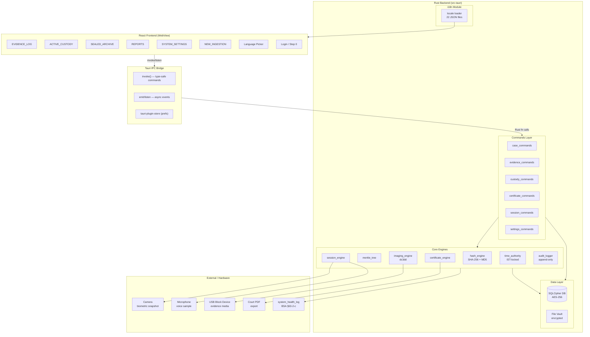
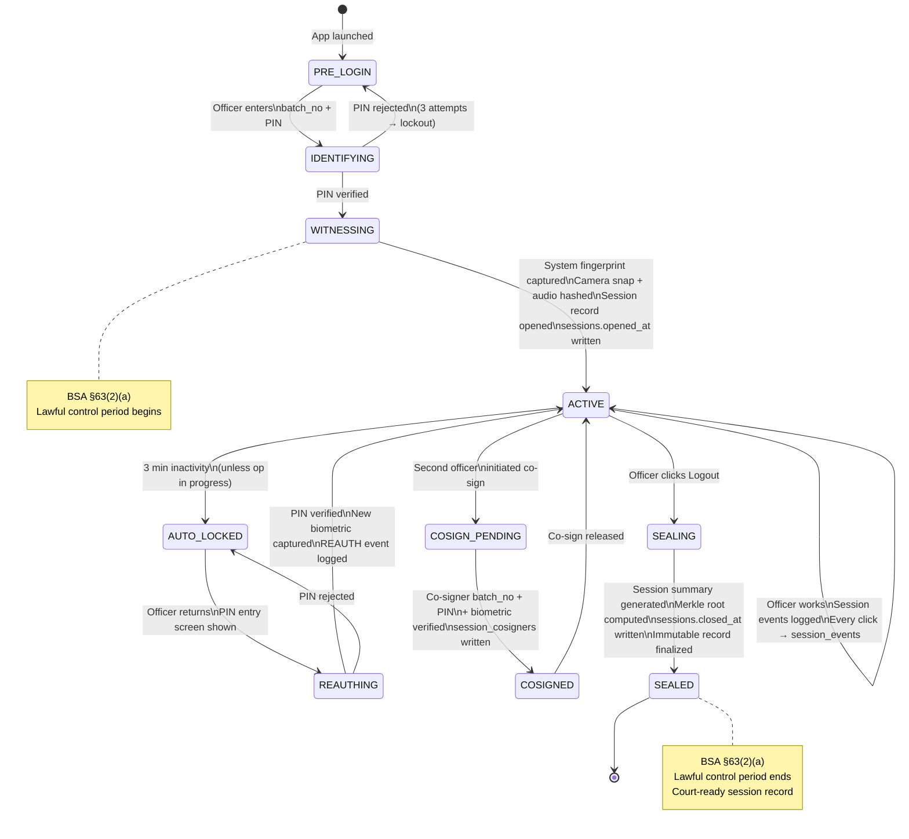
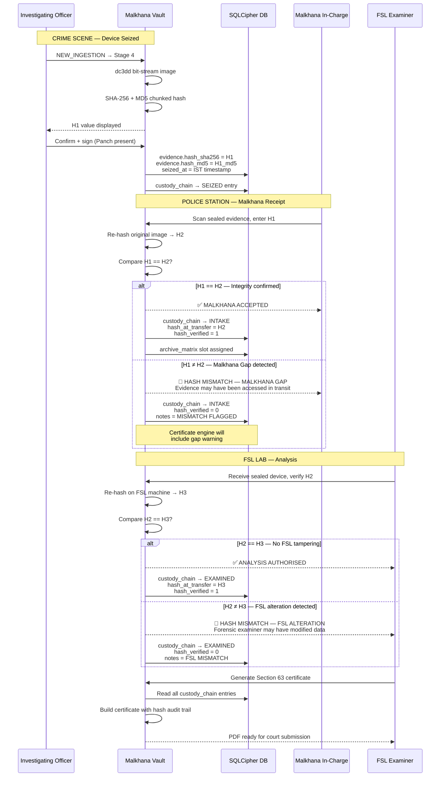

<table border="0" cellspacing="0" cellpadding="0">
<tr>
<td width="65%" valign="top">

# MALKHANA VAULT — DIGITAL EVIDENCE CUSTODIAN

> **Malkhana Vault** is an offline-first, forensic-grade digital evidence management system built for Indian law enforcement. It transforms physical Malkhana (police property room) logbooks into a cryptographically secured local desktop application — establishing a court-admissible chain of custody under the **Bharatiya Sakshya Adhiniyam (BSA), 2023** and **Bharatiya Nagarik Suraksha Sanhita (BNSS), 2023**.
>
> Every login opens a legally-bound custody session. Every evidence entry is anchored to a birth hash. Every handoff is triple-verified. The system produces a signed BSA Section 63 Admissibility Certificate exportable directly to court.


</td>
<td width="35%" valign="middle" align="center">
  
</td>
</tr>
</table>

---

## Compliance & Technology Badges


---

## Table of Contents

1. [System Architecture](#1-system-architecture)
2. [Ingestion to Court Data Flow](#2-ingestion-to-court-data-flow)
3. [Session-as-Chain-of-Custody (Step 0)](#3-session-as-chain-of-custody-step-0)
4. [Triple-Hash Verification Sequence](#4-triple-hash-verification-sequence)
5. [User Personas & Operational Roles](#5-user-personas--operational-roles)
6. [National Cyber Forensic Protocol Alignment](#6-national-cyber-forensic-protocol-alignment)
7. [Security & Database Architecture](#7-security--database-architecture)
8. [Sandbox & Demo Credentials](#8-sandbox--demo-credentials)
9. [Developer Onboarding & Local Build](#9-developer-onboarding--local-build)
10. [Known Issues & Technical Debt](#10-known-issues--technical-debt)
11. [Documentation Index](#11-documentation-index)

---

## 1. System Architecture

Malkhana Vault separates concerns across a React-based industrial WebView frontend, a secure Tauri IPC bridge, and a memory-safe Rust backend.

| Architectural Layer | Technology | Key Concern & Forensic Guardrail |
|---------------------|------------|---------------------------------|
| **Frontend UI** | React 19.2 + Vite + Tailwind CSS | Modern blueprint-style interface, zero local storage caching, locale translation context. |
| **Desktop Shell** | Tauri v2.11 WebView | Secure sandboxed shell, IPC command bridge (`tauri::invoke`), local file/process management. |
| **Backend Core** | Rust 1.95 (Stable) | Multi-threaded chunked file hashing, dc3dd process spawning, local system validation. |
| **Data Layer** | rusqlite + bundled-sqlcipher | Statically compiled open-source database with AES-256-CBC encryption, WAL logging. |
| **Temporal Guard** | System RTC (locked to IST) | Enforces tamper-free, chronological timelines (UTC+05:30) for legal logs. |



---

## 2. Ingestion to Court Data Flow

Tracks the chronological custody and verification checks applied to digital evidence:


---

## 3. Session-as-Chain-of-Custody (Step 0)

Rather than just restricting user views, logging into Malkhana Vault opens a legally-bound custody session:



---

## 4. Triple-Hash Verification Sequence



---

## 5. User Personas & Operational Roles

Malkhana Vault uses Role-Based Access Control (RBAC) designed around four key law enforcement roles:

- **Investigating Officer (IO):** Initiates cases, logs new seizures, runs crime-scene hash triage, captures Panch witness details, and generates Form CC-1.
- **Malkhana In-Charge:** Oversees physical evidence intake, maps devices to the 150-drawer matrix grid, and executes the H2 Receipt Hash integrity check.
- **Forensic Examiner (FSL Expert):** Generates bit-stream images, runs post-extraction H3 hashes, audits the chain, and signs the Section 63 Admissibility Certificate.
- **Court Records Clerk:** Verifies the cryptographic chain and validates exported digital signatures before presenting evidence to the magistrate.

---

## 6. National Cyber Forensic Protocol Alignment

The application matches the step-by-step custody lifecycle defined in the **National Cyber Forensic Protocol**:

1. **Crime Scene Ingestion:** IO generates the **H1 Birth Hash** immediately at the scene. Panch witness details and write-blocker usage are recorded.
2. **Sealed Storage Handoff:** Malkhana In-Charge assigns physical coordinates (matrix grid) and verifies the **H2 Receipt Hash** ($H_1 == H_2$) to detect any "Malkhana Gap" during transport.
3. **Laboratory Forensic Imaging:** FSL Examiner re-verifies the H2 hash, writes a bit-stream forensic image copy, generates the **H3 Analysis Hash**, and verifies that $H_2 == H_3$ to prove zero alteration by the analyst.
4. **Admissibility Certification:** The FSL Expert exports the cryptographically-sealed **BSA Section 63 Admissibility Certificate** containing the full audit history.

---

## 7. Security & Database Architecture

### Cryptographic Ledger (SQLCipher Schema)

All transaction schemas are cryptographically linked in an encrypted, append-only SQLite database:

- **`officer_profiles` & `sessions`:** Auth is treated as a custody event (Step 0). Captures system fingerprints (MAC, IP, Hostname) and biometrics.
- **`cases` & `evidence`:** Maps digital evidence parameters, status (`ACTIVE`, `SEALED`, `DISPOSED`), and H1/H2/H3 hash values.
- **`audit_log`:** Encoded as a chronological Merkle Tree log. Any attempt to modify a past row invalidates the Merkle Root, rendering database tampering immediately obvious.
- **`system_health_log`:** Captures system lifecycle events (`STARTUP`, `SHUTDOWN`, `POWER_LOSS`, `CRASH`) for automated compliance with **BSA Section 63(2)(c)**.

### Power Loss & Offline Resilience

- **SQLite WAL Mode:** Police stations in rural regions experience frequent load-shedding. The database operates in Write-Ahead Logging (WAL) mode — transactions are committed to a log file first, ensuring zero database corruption if the machine drops power mid-write.
- **PBKDF2 Key Derivation:** Master database encryption keys are derived using 256,000 PBKDF2 iterations with SHA-256, defending against offline brute-force attacks.
- **Multilingual Vernacular Support:** Full localization for all 22 scheduled languages of India (treated equally without hierarchy) ensures clear UI operation in regional languages.

> ⚠️ **Offline Font Note:** The application loads Space Mono and 22 Noto script fonts from Google Fonts CDN at startup. On fully air-gapped machines, font fetches will fail silently and the OS fallback fonts will be used. UI layout remains functional, but regional script rendering may degrade. A bundled-font build variant is planned.

---

## 8. Sandbox & Demo Credentials

For testing and evaluation in the sandbox environment, use the following pre-seeded credentials:

| Field | Value |
|---|---|
| **Officer ID / Batch Number** | `op_092` |
| **PIN** | `092092` |
| **Password** | `092092` |
| **Role** | Administrator / Investigating Officer |

> ⚠️ **Do not delete `malkhana.db`** during testing unless you intend to wipe all local state. To reset safely, re-run with demo credentials above.

---

## 9. Developer Onboarding & Local Build

### Key Files to Read First

| File | Why |
|---|---|
| `src-tauri/src/data/schema.rs` | Defines the forensic database schema — the source of truth for all data models |
| `src/api/invoke.js` | Tauri IPC bridge — every frontend-to-backend call goes through here |
| `src/App.jsx` | Monolithic frontend controller — manages auth, routing, and view state |

### Mental Model

Think of it as a high-security vault: the React frontend is the teller window, the Tauri IPC is the pneumatic tube, and the Rust/SQLCipher backend is the cryptographic vault itself.

### Prerequisites

1. **Rust:** Stable toolchain (1.77.2+)
2. **Node.js:** v18+ (v20 recommended) with `npm`
3. **C++ Build Tools:** Required to compile SQLCipher from source
4. **OpenSSL:** Win64 OpenSSL v3.x or v1.1.1 (Windows only — ensure `OPENSSL_DIR` is set)

### Getting Started

```bash
# Install frontend dependencies
npm install

# Launch in development mode
npm run tauri:dev
```

### Compile Production Installers

```bash
npm run tauri:build
```

- **Windows:** Produces `.msi` and `.exe` (NSIS) installers in `src-tauri/target/release/bundle/`
- **Linux:** Produces `.deb`, `.AppImage`, and `.rpm` packages

### Where to Make Changes

| Task | Location |
|---|---|
| Add DB tables | `schema.rs` + `models.rs` |
| Add backend logic | `commands/*.rs` |
| Add UI views | `src/components/` → wire in `App.jsx` |
| Add translations | `src/i18n.js` (locale dictionaries) |

---

## 10. Known Issues & Technical Debt

These are tracked and acknowledged — contributions are welcome:

| Severity | Issue |
|---|---|
| 🔴 High | **Hardcoded fallback key** in `user_commands.rs` (`malkhana-vault-2024-secure-key-v1`). Must be removed before any production deployment. |
| 🔴 High | **`App.jsx` is a God Object** — handles auth, routing, state, and layout. Needs decomposition into context providers and a proper router. |
| 🟡 Medium | **Schema avoidance in `signing_commands.rs`** — digital signatures are stuffed into the `device_description` text column to bypass SQLite migrations. |
| 🟡 Medium | **No `.env.example`** and no developer setup guide for Windows/Linux-specific OpenSSL path configuration. |
| 🟡 Medium | **Stub files are empty** — `encryption.rs`, `integrity_checker.rs`, `constants.rs`, `formatters.rs`, `validators.rs` contain no logic yet. |
| 🟢 Low | **Font CDN dependency** — `fontLoader.js` fetches from Google Fonts, breaking regional script rendering on air-gapped machines. |
| 🟢 Low | **Test coverage is minimal** — cryptographic and Merkle validation paths lack integration tests. |

> See `SECURITY.md` (planned) for responsible disclosure of security-related issues.

---

## 11. Documentation Index

Extended documentation is published to the `gh-pages` branch and served via GitHub Pages:

- **[Live Project Homepage & Demo Walkthrough](https://chandranshgupta.github.io/Malkhana/)**
- **[Printable Product Brief (PDF)](https://chandranshgupta.github.io/Malkhana/collateral/product-brief.pdf)**
- **[Cryptographic Architecture Whitepaper (PDF)](https://chandranshgupta.github.io/Malkhana/collateral/cryptographic-whitepaper.pdf)**
- **[Forensic & Legal Compliance Report (PDF)](https://chandranshgupta.github.io/Malkhana/compliance-report.pdf)**
- **[Sandbox Evaluation & Credentials Manual (PDF)](https://chandranshgupta.github.io/Malkhana/evaluation.pdf)**
- **[Step 0 Login Custody Explainer (PDF)](https://chandranshgupta.github.io/Malkhana/session-custody.pdf)**
- **[Triple-Hash Verification Protocol (PDF)](https://chandranshgupta.github.io/Malkhana/triple-hash.pdf)**
- **[Hardware & Offline Fallback FAQ (PDF)](https://chandranshgupta.github.io/Malkhana/hardware-faq.pdf)**
- **[Compilation & Developer Onboarding Guide (PDF)](https://chandranshgupta.github.io/Malkhana/contributing.pdf)**

---

> **License:** Proprietary. All rights reserved. This software is developed for Indian law enforcement use in compliance with BSA 2023 and BNSS 2023.
