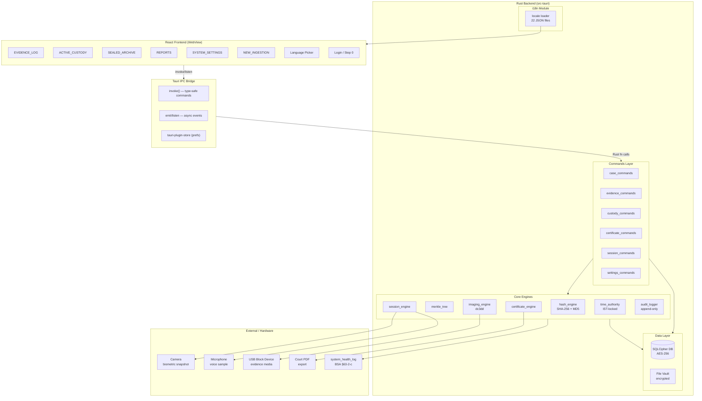
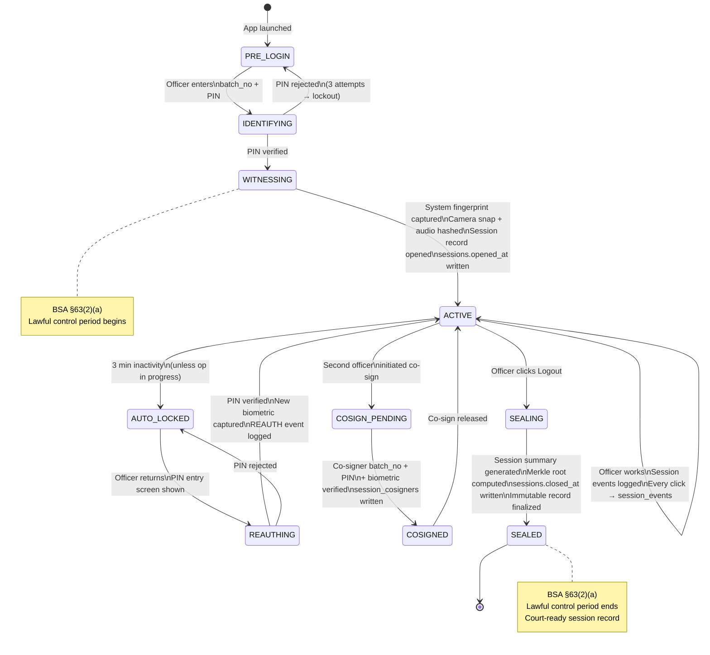
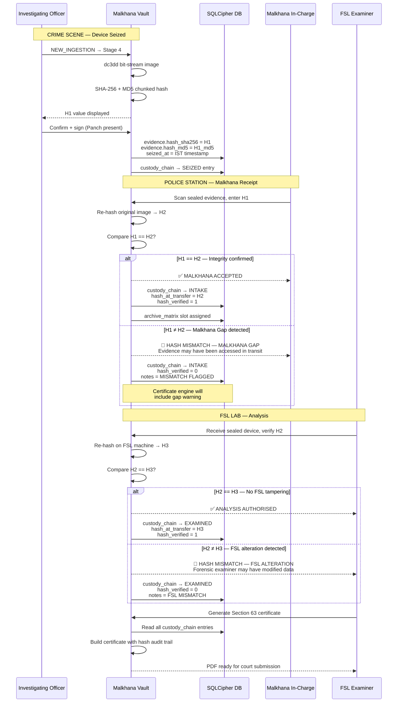

# MALKHANA VAULT — DIGITAL EVIDENCE CUSTODIAN

Malkhana Vault is an **offline-first, forensic-grade digital evidence management system** designed specifically for Indian law enforcement. It digitizes physical Malkhana (police property room) logs into a secure local desktop application, establishing compliance under the **Bharatiya Sakshya Adhiniyam (BSA), 2023** and **Bharatiya Nagarik Suraksha Sanhita (BNSS), 2023**.

---

## Compliance & Technology Badges

---

## 1. System Architecture

Malkhana Vault separates concerns across a React-based industrial Webview frontend, a secure Tauri IPC bridge, and a memory-safe Rust backend.

| Architectural Layer | Technology | Key Concern & Forensic Guardrail |
|---------------------|------------|---------------------------------|
| **Frontend UI** | React 19.2 + Vite + Tailwind CSS | Modern blueprint-style interface, zero local storage caching, locale translation context. |
| **Desktop Shell** | Tauri v2.11 WebView | Secure sandboxed shell, IPC command bridge (`tauri::invoke`), local file/process management. |
| **Backend Core** | Rust 1.95 (Stable) | Multi-threaded chunked file hashing, dc3dd process spawning, local system validation. |
| **Data Layer** | rusqlite + bundled-sqlcipher | Statically compiled open-source database with AES-256-CBC encryption, WAL logging. |
| **Temporal Guard** | System RTC (locked to IST) | Enforces tamper-free, chronological timelines (UTC+05:30) for legal logs. |

---

## 2. Ingestion to Court Data Flow

Tracks the chronological custody and verification checks applied to digital evidence:

---

## 3. Session-as-Chain-of-Custody (Step 0)

Rather than just restricting user views, logging into Malkhana Vault opens a legally-bound custody session:

---

## 4. Triple-Hash Verification Sequence

---

## 5. Directory Mapping & Documentation Index

All primary documentation resides in the `docs/` folder to ensure this README remains high-level and scannable:

- **[Sandbox Evaluation Guide](file:///d:/Carrer/Projects/Malkhana/docs/evaluation.md):** Pre-seeded credentials (batch numbers, passwords, PINs) and walking through a trial ingestion.
- **[Step 0 Login Custody Explainer](file:///d:/Carrer/Projects/Malkhana/docs/session-custody.md):** Background on lawful control, fingerprinting, and session seals under BSA §63(2).
- **[Triple-Hash Verification details](file:///d:/Carrer/Projects/Malkhana/docs/triple-hash.md):** Detailed breakdown of H1, H2, H3 validation and handling forensic mismatches.
- **[Hardware & Offline Fallback FAQ](file:///d:/Carrer/Projects/Malkhana/docs/hardware-faq.md):** Operational guidelines for rural stations lacking cameras, mics, or persistent internet.
- **[Compilation & Contributing Guide](file:///d:/Carrer/Projects/Malkhana/docs/contributing.md):** Compilation steps for Node.js/Rust build chains and statically bundling SQLCipher.
