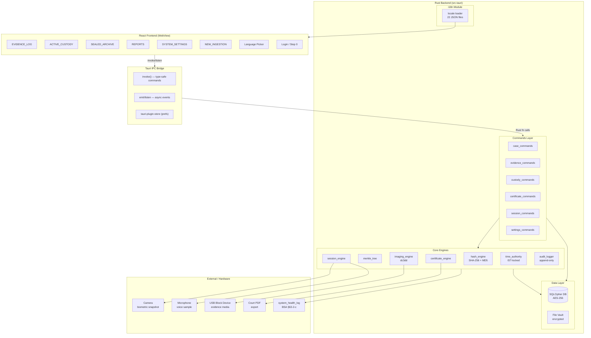
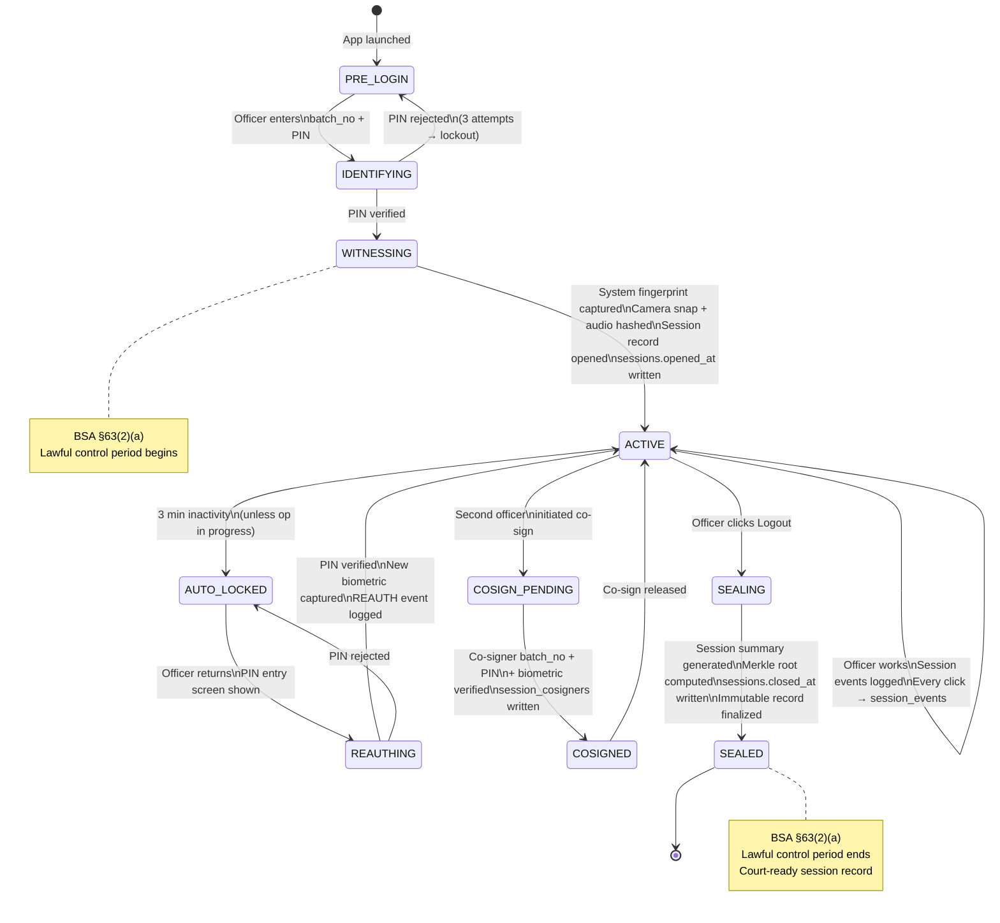
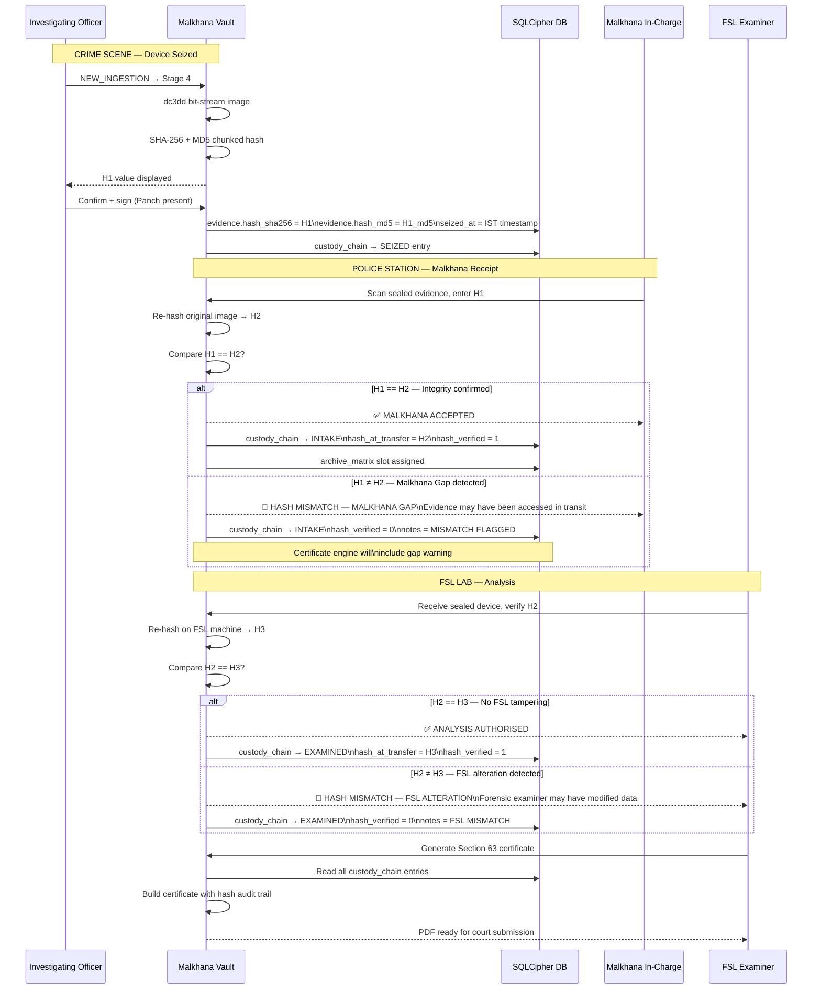
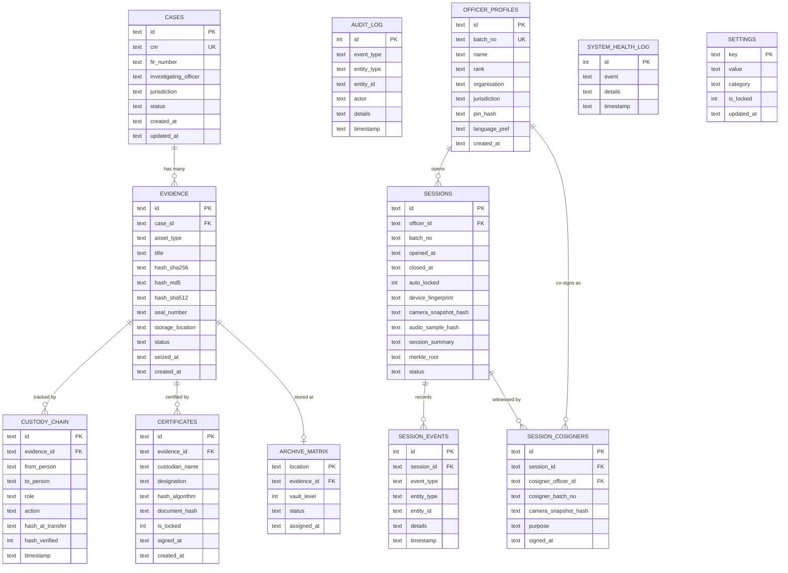
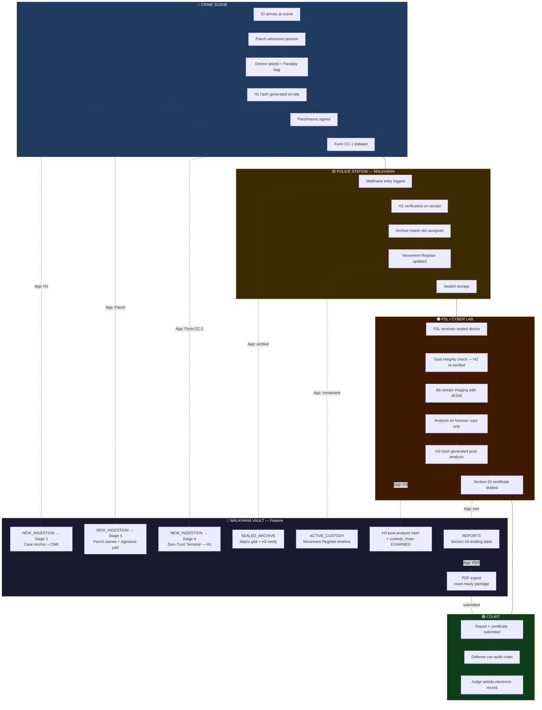
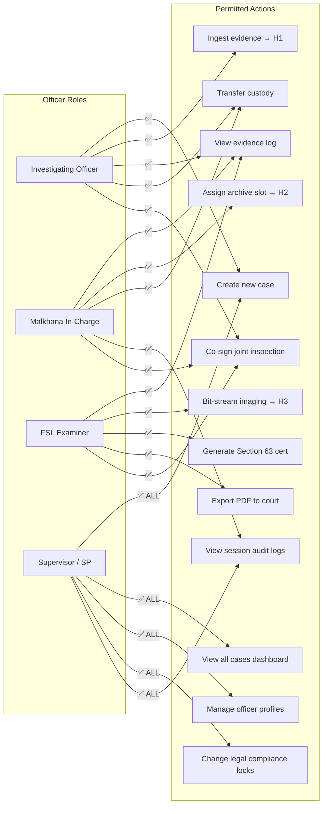
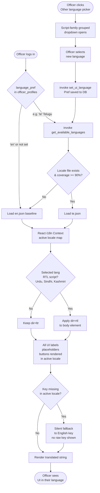
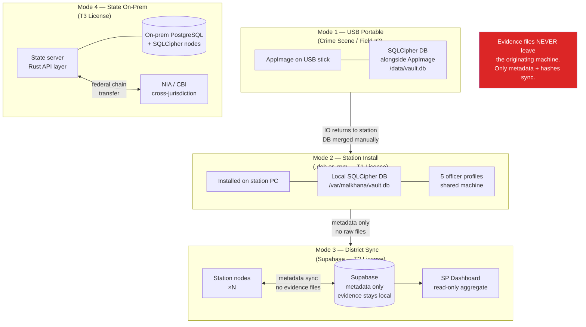
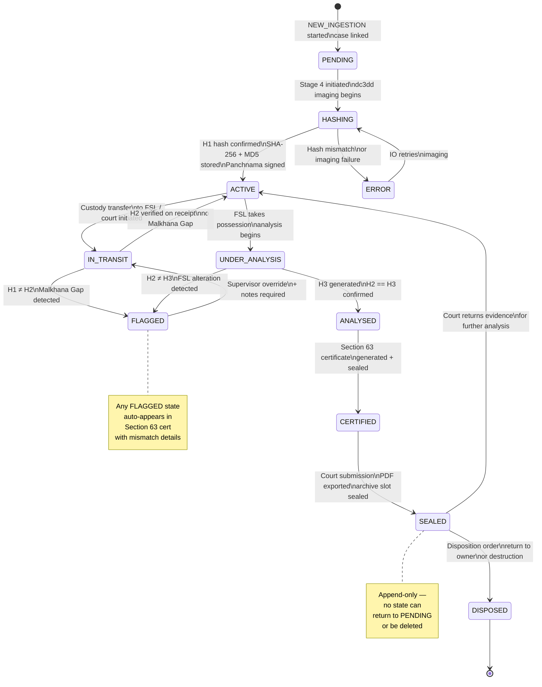

# MALKHANA VAULT — PRD v6.2
## Forensic Evidence Management System
### Tauri v2 + React + Rust Architecture

> **Classification:** INTERNAL — DEVELOPMENT REFERENCE  
> **Version:** 6.2.0 | **Date:** 2026-05-16  
> **Author:** Chandransh Gupta  
> **Supersedes:** PRD v6.1  
> **Change Summary (v6.1):** Added Session-as-Chain-of-Custody login system (Step 0), biometric session witnessing, multilingual UI framework, system downtime logging for BSA §63(2)(c) compliance, co-sign/joint inspection workflow, and auto-lock session recovery.  
> **Change Summary (v6.2):** Added Section 24 — System Design Diagrams (Mermaid): overall architecture, data flow, session lifecycle, Triple-Hash protocol, database ER diagram, Indian investigation workflow, RBAC, multilingual i18n flow, deployment topology, and evidence state machine.

---

## Table of Contents

1. [Executive Summary](#1-executive-summary)
2. [Architectural Pivot](#2-architectural-pivot)
3. [Target Users & Personas](#3-target-users--personas)
4. [Legal Framework Alignment](#4-legal-framework-alignment)
5. [Product Tiers & Monetization](#5-product-tiers--monetization)
6. [Locked Design Decisions](#6-locked-design-decisions)
7. [Technical Stack](#7-technical-stack)
8. [Rust Backend Architecture](#8-rust-backend-architecture)
9. [Frontend Architecture](#9-frontend-architecture)
10. [Development Standards & Coding Conventions](#10-development-standards--coding-conventions)
11. [Database Schema](#11-database-schema)
12. [Security Architecture](#12-security-architecture)
13. [Feature Specification — UI Gap Analysis](#13-feature-specification)
14. [Indian Investigation Workflow Alignment](#14-indian-investigation-workflow)
15. [Risk Analysis & Mitigation](#15-risk-analysis--mitigation)
16. [Key Performance Indicators (KPIs)](#16-key-performance-indicators)
17. [Competitive Landscape](#17-competitive-landscape)
18. [Packaging & Deployment](#18-packaging--deployment)
19. [Phased Execution](#19-phased-execution)
20. [Agent Skills Reference](#20-agent-skills-reference)
21. [Glossary](#21-glossary)
22. [Session-as-Chain-of-Custody — Login System (Step 0)](#22-session-as-chain-of-custody)
23. [Multilingual UI Framework](#23-multilingual-ui-framework)
24. [System Design Diagrams](#24-system-design-diagrams)

---

## 1. Executive Summary

Malkhana Vault is a **forensic-grade digital evidence management system** built for Indian law enforcement. It digitizes the physical Malkhana (police property room) into an offline-first desktop application with cryptographic integrity verification, BSA Section 63 certificate generation, and immutable chain-of-custody tracking.

**What changed in v6.0:** The entire backend pivots from Python/PySide6 to **Rust via Tauri v2**. The React UI (App.jsx, 1380 lines) that was previously a "design reference" is now the **production frontend** running inside Tauri's WebView. This eliminates the Qt translation effort entirely.

**What changed in v6.1:** Login is no longer just access control — it is **Step 0 of the chain of custody**. Every session is a sealed, biometrically-witnessed, system-fingerprinted custody event fully aligned with BSA Section 63(2). Additionally, the UI now supports **all 22 scheduled Indian languages** with no hierarchy — Hindi has no special status above any other regional language.

---

## 2. Architectural Pivot

### What Changed

| Aspect | PRD v5.0 | PRD v6.0 | Rationale |
|--------|----------|----------|-----------|
| Backend | Python 3.11 / PySide6 | **Rust / Tauri v2** | 10x faster hashing, memory-safe, native Linux packaging |
| Frontend | PySide6 QSS (translated from React) | **React 19 + Tailwind** (direct) | Already built — zero translation needed |
| Desktop Shell | Qt6 Window | **Tauri WebView** | Lightweight (~5MB vs ~150MB Qt), native OS integration |
| Database | SQLCipher via Python | **rusqlite + bundled-sqlcipher** | Battle-tested encryption, Rust-native |
| Packaging | Flatpak / custom AppImage | **Tauri bundler** (deb, AppImage, RPM) | Built-in, one command |
| PDF Generation | ReportLab / WeasyPrint | **WebView print-to-PDF** | Zero extra deps, uses existing React certificate UI |
| IPC | N/A | **tauri::invoke()** | Type-safe React↔Rust bridge |

### What Did NOT Change

All 17 original design decisions (D1–D17) remain locked except D8 and D11:
- D1: BSA Section 63 exact certificate format ✅
- D2: Offline-first architecture ✅  
- D3: Triple-Hash Protocol (H1→H2→H3) ✅
- D4: IST timezone locked (UTC+05:30) ✅
- D5: Blueprint/brutalist UI aesthetic ✅
- D6: USB portable deployment ✅
- D7: Append-only, no deletes ✅
- D9: Mono font, uppercase labels ✅
- D10: 6 core views ✅
- **D18 (NEW):** Login = Step 0 of chain of custody — every session is a sealed custody event ✅
- **D19 (NEW):** No language hierarchy — all 22 scheduled Indian languages treated equally ✅

---

## 3. Target Users & Personas

### 3.1 Primary Users

| Persona | Role | Key Pain Point | How Vault Solves It |
|---------|------|----------------|---------------------|
| **SI Rajesh Sharma** | Investigating Officer (IO) | Manually writes panchnama, forgets hash at scene, evidence challenged in court | One-click H1 hash generation at seizure, auto-populates Form CC-1 |
| **HC Priya Verma** | Malkhana In-Charge | Paper register, items get lost, no tracking of who accessed what | Digital matrix grid, H2 verification on receipt, audit trail |
| **Dr. Amit Patel** | FSL Forensic Examiner | Receives devices without hash, spends hours on paperwork instead of analysis | H2/H3 verification, auto-generated Section 63 certificate |
| **Clerk Sunita Devi** | Court Records Clerk | Receives evidence in inconsistent formats, can't verify chain | Standardized PDF exports, hash verification log included |

### 3.2 Secondary Users

| Persona | Role | Use Case |
|---------|------|----------|
| **SP / DIG** | Supervisory Officer | Dashboard metrics — how many cases active, evidence backlog, SLA breaches |
| **Cyber Cell Head** | State Cyber Police | Bulk digital evidence management (500+ USB drives per quarter) |
| **NIA / CBI Agent** | Central Agency | Cross-jurisdiction evidence transfer with federal chain compliance |
| **Defense Advocate** | Legal Aid Counsel | Audit the chain of custody to challenge prosecution evidence |

### Deployment Context

- **Typical Malkhana:** 1 desktop PC, no internet, shared by 3–5 officers
- **FSL Lab:** Networked workstation, specialized forensic tools (Cellebrite, FTK)
- **Court:** Receives PDF reports only — no app installation needed
- **USB Mode:** IO carries AppImage on a USB stick to crime scenes with a laptop

---

## 4. Legal Framework Alignment

### BSA 2023 — Section 63 (replaces IEA Section 65B)

The Section 63 certificate must attest to:
1. **Device Health** — the computer was operating properly during the period of record creation
2. **Automated Storage** — data was fed into the device in the ordinary course of activities
3. **Integrity** — no unauthorized alteration affects the accuracy
4. **Chain of Custody** — unbroken log from seizure to court

> **v6.1 Addition — §63(2)(c) Downtime Compliance:** The law requires that if the system was ever *not* operating properly, that must be explicitly noted and it must not have affected the record's accuracy. Malkhana Vault now automatically flags any session or entry created within a recovery window after a system interruption. A `system_health_log` table records all downtime events; the Section 63 certificate generation checks this log and includes a compliance note if any interruption occurred during the relevant evidence period.

### Triple-Hash Verification Protocol (Validated by 2026 Forensic Standards)

| Hash | When | Who | Purpose |
|------|------|-----|---------|
| **H1 (Birth Hash)** | At crime scene seizure | Investigating Officer (IO) | Baseline proof of original state |
| **H2 (Receipt Hash)** | Before opening seal at FSL/Malkhana | Malkhana In-Charge / FSL Expert | Proves no tampering during transport |
| **H3 (Analysis Hash)** | After forensic imaging | Forensic Examiner | Confirms data integrity post-extraction |

**Rule:** If H1 ≠ H2 → "Malkhana Gap" (device accessed during transport). If H2 ≠ H3 → FSL expert altered data. Both are grounds for evidence exclusion.

### BNSS 2023 — Section 153 (Seizure Power)

- Mandatory Form CC-1 (Chain of Custody form) signed by Seizing Officer, Imaging Specialist, and Malkhana Safe-Keeper
- Panch witnesses must verify hash generation at scene
- Movement Register must log every second of device location

### Common Court Rejection Reasons (our app must prevent these)

1. No hash value generated at seizure scene
2. Gap in chain of custody timeline (even 5 minutes)
3. Device connected without write-blocker
4. Forensic image in wrong format (must be .E01 or .raw/dd)
5. Section 63 certificate signed by unqualified person
6. No Faraday isolation documented for mobile devices
7. Logical copy instead of bit-stream physical image
8. FSL computer clock miscalibrated
9. MD5-only hashing (must use dual: MD5 + SHA-256)
10. Missing Panch witness signatures on Panchnama

---

## 5. Product Tiers & Monetization

### Tier Structure

| Tier | Name | Target | Price | Key Features |
|------|------|--------|-------|-------------|
| **T0** | Open Core | Individual IOs, small stations | **Free / Open Source** | Single-user, local DB, 3 concurrent cases, AppImage only |
| **T1** | Station License | Police Station (1 Malkhana) | ₹15,000/year | Multi-user (5 seats), unlimited cases, .deb/.rpm, email support |
| **T2** | District License | SP Office / District HQ | ₹75,000/year | 25 seats, Supabase sync, priority support, training webinar |
| **T3** | State/Central | State Cyber Cell / NIA / CBI | Custom (₹3–8L/year) | Unlimited seats, on-prem server, dedicated support engineer, SLA |

### Revenue Model

- **Primary:** Annual license fees (T1–T3)
- **Secondary:** Training & certification workshops for IOs (₹5,000/officer)
- **Tertiary:** Custom integration consulting (FSL API bridges, state-specific forms)
- **Strategic:** Government tender positioning — target BPR&D (Bureau of Police Research) and NCRB procurement cycles

### Open Source Strategy

T0 is free and fully functional for single users. This creates adoption at the grassroots (individual IOs and small rural stations) which drives bottom-up demand for T1–T3 licenses at the district/state procurement level.

---

## 6. Locked Design Decisions

### Visual Design Language (IMMUTABLE)

- **Blueprint Grid:** 20px minor grid + 100px major grid, slate-500 color
- **Color Palette:** `#f4f7f9` background, `#1e293b` primary, `#0ea5e9` accent, `#dc2626` alert
- **Typography:** `font-mono` system-wide, uppercase labels, tracking-widest
- **Corner Marks:** 2px border corners on all cards/panels
- **Shadow System:** `4px 4px 0px` brutalist offset shadows
- **Red Thread:** SVG bezier path connecting custody chain nodes
- **Stamps:** Circular SVG stamps with "FORENSIC CONTROL" text path
- **Animation:** `stamp-drop` keyframe for document sealing, pulse for alerts

### 6 Core Views (IMMUTABLE)

| View | Component | Status |
|------|-----------|--------|
| EVIDENCE_LOG | Blueprint cards with wireframe SVGs | UI ✅ / Backend ❌ |
| ACTIVE_CUSTODY | Node-based investigation board with red thread | UI ✅ / Backend ❌ |
| SEALED_ARCHIVE | 15×10 coordinate matrix grid | UI ✅ / Backend ❌ |
| REPORTS | Section 63 drafting table with live preview | UI ✅ / Backend ❌ |
| SYSTEM_SETTINGS | Industrial toggles + legal compliance lock | UI ✅ / Backend ❌ |
| NEW_INGESTION | 4-stage wizard with zero-trust terminal | UI ✅ / Backend ❌ |

---

## 7. Technical Stack

### Production Stack

```
┌─────────────────────────────────────────┐
│           MALKHANA VAULT v6.0           │
├─────────────────────────────────────────┤
│  Frontend    │ React 19.2 + Tailwind 3  │
│  Icons       │ Lucide React             │
│  Bundler     │ Vite 8.0                 │
│  Desktop     │ Tauri v2.11              │
│  Backend     │ Rust 1.95 (2021 edition) │
│  Database    │ SQLite + SQLCipher       │
│  Hashing     │ sha2, md-5 crates        │
│  Packaging   │ AppImage / .deb / .rpm   │
│  VCS         │ Git + GitHub             │
└─────────────────────────────────────────┘
```

### Tauri Plugins

| Plugin | Crate | Purpose |
|--------|-------|---------|
| `tauri-plugin-fs` | File system access | Read/write evidence vault |
| `tauri-plugin-shell` | Subprocess execution | dc3dd imaging commands |
| `tauri-plugin-dialog` | Native dialogs | File picker, confirmation |
| `tauri-plugin-notification` | OS notifications | Hash complete, alerts |
| `tauri-plugin-process` | Process management | Graceful shutdown |
| `tauri-plugin-store` | Persistent KV store | User preferences |
| `tauri-plugin-log` | Structured logging | Audit trail |

---

## 8. Rust Backend Architecture

```
src-tauri/src/
├── main.rs                         # Entry point
├── lib.rs                          # Tauri builder + plugin registration
├── commands/                       # Tauri invoke handlers
│   ├── mod.rs
│   ├── case_commands.rs            # Case CRUD, CNR lookup
│   ├── evidence_commands.rs        # Evidence ingestion + hashing
│   ├── custody_commands.rs         # Chain of custody transfers
│   ├── certificate_commands.rs     # Section 63 PDF generation
│   ├── archive_commands.rs         # Sealed archive grid operations
│   ├── search_commands.rs          # Global + matrix search
│   ├── settings_commands.rs        # Engine config persistence
│   └── session_commands.rs         # [v6.1] Login/logout, biometric capture, session audit
├── core/                           # Business logic (UI-agnostic)
│   ├── mod.rs
│   ├── hash_engine.rs              # SHA-256, MD5, SHA-512 chunked
│   ├── certificate_engine.rs       # BSA Section 63 template
│   ├── imaging_engine.rs           # dc3dd subprocess via shell
│   ├── merkle_tree.rs              # Merkle audit trail
│   ├── audit_logger.rs             # Append-only event log
│   ├── vault_manager.rs            # File vault CRUD
│   ├── time_authority.rs           # IST-locked timestamps
│   ├── device_detector.rs          # USB/disk detection
│   └── session_engine.rs           # [v6.1] Session sealing, biometric hashing, auto-lock
├── data/                           # Data layer
│   ├── mod.rs
│   ├── database.rs                 # SQLCipher init + migrations
│   ├── models.rs                   # Serde structs
│   ├── schema.rs                   # SQL DDL
│   └── repository.rs              # Query functions
├── security/                       # Encryption module
│   ├── mod.rs
│   ├── encryption.rs               # DB key management
│   ├── key_derivation.rs           # PBKDF2
│   └── integrity_checker.rs        # H1/H2/H3 verification
├── i18n/                           # [v6.1] Internationalisation
│   ├── mod.rs
│   ├── loader.rs                   # Load locale JSON at runtime
│   └── locales/                    # One JSON per language (22 total)
│       ├── en.json
│       ├── hi.json
│       ├── bn.json
│       ├── te.json
│       ├── mr.json
│       ├── ta.json
│       ├── gu.json
│       ├── kn.json
│       ├── ml.json
│       ├── pa.json
│       ├── or.json
│       ├── as.json
│       ├── ur.json
│       ├── mai.json
│       ├── sa.json
│       ├── ks.json
│       ├── ne.json
│       ├── sd.json
│       ├── kok.json
│       ├── doi.json
│       ├── mni.json
│       └── sat.json
└── utils/
    ├── mod.rs
    ├── constants.rs                # App-wide constants
    ├── validators.rs               # Input sanitization
    └── formatters.rs               # IST date formatting
```

### Key Invoke Commands

```rust
// React calls these via: invoke('command_name', { args })
#[tauri::command] fn create_case(cnr: String, fir: String, io: String) -> Result<Case>;
#[tauri::command] fn ingest_evidence(case_id: String, asset_type: String) -> Result<Evidence>;
#[tauri::command] fn hash_file(path: String) -> Result<HashResult>;
#[tauri::command] fn transfer_custody(evidence_id: String, to: String) -> Result<CustodyEvent>;
#[tauri::command] fn generate_certificate(evidence_id: String) -> Result<CertificateData>;
#[tauri::command] fn search_archive(query: String) -> Result<Vec<ArchiveEntry>>;
#[tauri::command] fn get_settings() -> Result<AppSettings>;
#[tauri::command] fn update_setting(key: String, value: String) -> Result<()>;
#[tauri::command] fn get_evidence_log() -> Result<Vec<Evidence>>;
#[tauri::command] fn get_custody_chain(evidence_id: String) -> Result<Vec<CustodyNode>>;
#[tauri::command] fn detect_devices() -> Result<Vec<BlockDevice>>;
// v6.1 — Session / Auth commands
#[tauri::command] fn open_session(batch_no: String, pin: String, biometric_payload: BiometricCapture) -> Result<SessionToken>;
#[tauri::command] fn close_session(session_id: String) -> Result<SessionSummary>;
#[tauri::command] fn reauth_session(session_id: String, biometric_payload: BiometricCapture) -> Result<()>;
#[tauri::command] fn get_session_log(session_id: String) -> Result<Vec<SessionEvent>>;
#[tauri::command] fn cosign_session(session_id: String, cosigner_batch_no: String, biometric_payload: BiometricCapture) -> Result<()>;
// v6.1 — Language commands
#[tauri::command] fn set_ui_language(lang_code: String) -> Result<()>;
#[tauri::command] fn get_available_languages() -> Result<Vec<LanguageOption>>;
```

---

## 9. Frontend Architecture

The React frontend (App.jsx) requires these modifications to connect to Rust:

### Import Pattern
```javascript
import { invoke } from '@tauri-apps/api/core';

// Example: fetch evidence log from Rust DB
const evidence = await invoke('get_evidence_log');

// Example: hash a file
const result = await invoke('hash_file', { path: '/dev/sdb' });
```

### State Management Strategy
- **Local React state** for UI-only concerns (hover, modal open/close)
- **invoke() calls** for all data operations (no localStorage for evidence data)
- **tauri-plugin-store** for user preferences (theme, imager choice, thread count)

## 10. Development Standards & Coding Conventions

### Rust Backend Standards

- **Error Handling:** All functions return `Result<T, AppError>` using `thiserror` — no `.unwrap()` in production code
- **Naming:** `snake_case` for functions/variables, `PascalCase` for structs/enums, `SCREAMING_SNAKE` for constants
- **Module Organization:** One file per command group, one file per core engine
- **Logging:** Use `log` crate macros (`info!`, `warn!`, `error!`) — never `println!` in production
- **Timestamps:** All timestamps via `time_authority.rs` — IST (UTC+05:30) locked, ISO 8601 format
- **Serialization:** All cross-boundary structs derive `serde::Serialize` + `serde::Deserialize`
- **Testing:** Unit tests in same file (`#[cfg(test)]`), integration tests in `tests/` directory
- **No unsafe:** Zero `unsafe` blocks unless cryptographically justified and documented

### React Frontend Standards

- **Component Pattern:** Functional components with hooks only — no class components
- **State Rule:** UI-only state in React, data state via `invoke()` — never `localStorage` for evidence
- **Naming:** `PascalCase` for components, `camelCase` for functions/variables, `UPPER_SNAKE` for constants
- **Styling:** Tailwind utility classes + CSS custom properties for design tokens — no inline style objects
- **Comments:** JSDoc for all exported functions, `// FORENSIC:` prefix for legal compliance code
- **No external requests:** Zero fetch/axios calls — all data flows through Tauri invoke bridge

### Git Conventions

- **Branch:** `feat/`, `fix/`, `refactor/`, `docs/` prefixes
- **Commits:** Conventional Commits format: `feat(hash-engine): implement SHA-256 chunked hashing`
- **PR:** Must pass Snyk security scan before merge
- **No secrets:** `.env` files in `.gitignore`, DB passwords never committed

### File Naming

| Layer | Convention | Example |
|-------|-----------|--------|
| Rust commands | `{domain}_commands.rs` | `evidence_commands.rs` |
| Rust core | `{engine}_engine.rs` | `hash_engine.rs` |
| Rust data | `{concern}.rs` | `models.rs`, `repository.rs` |
| React components | `{Name}.jsx` | `EvidenceLog.jsx` |
| Tests | `{module}_test.rs` | `hash_engine_test.rs` |

---

## 11. Database Schema

```sql
-- Core Tables (SQLCipher encrypted)

CREATE TABLE cases (
    id TEXT PRIMARY KEY,              -- UUID v4
    cnr TEXT UNIQUE,                  -- Computerized Node Record
    fir_number TEXT NOT NULL,
    investigating_officer TEXT NOT NULL,
    jurisdiction TEXT NOT NULL,
    status TEXT DEFAULT 'ACTIVE',     -- ACTIVE | SEALED | DISPOSED
    created_at TEXT NOT NULL,         -- ISO 8601, IST
    updated_at TEXT NOT NULL
);

CREATE TABLE evidence (
    id TEXT PRIMARY KEY,
    case_id TEXT NOT NULL REFERENCES cases(id),
    asset_type TEXT NOT NULL,         -- DISK | MOBILE | CCTV | USB | CLOUD | FILES
    title TEXT NOT NULL,
    description TEXT,
    tags TEXT,                        -- JSON array
    hash_sha256 TEXT,
    hash_md5 TEXT,
    hash_sha512 TEXT,
    seal_number TEXT,
    physical_condition TEXT,
    device_metadata TEXT,             -- JSON (IMEI, serial, etc.)
    storage_location TEXT,            -- Matrix coordinate (R5-C8)
    status TEXT DEFAULT 'ACTIVE',     -- ACTIVE | SEALED | ARCHIVED
    seized_at TEXT NOT NULL,
    created_at TEXT NOT NULL,
    CONSTRAINT fk_case FOREIGN KEY (case_id) REFERENCES cases(id)
);

CREATE TABLE custody_chain (
    id TEXT PRIMARY KEY,
    evidence_id TEXT NOT NULL REFERENCES evidence(id),
    from_person TEXT,
    to_person TEXT NOT NULL,
    role TEXT NOT NULL,               -- SEIZING_OFFICER | INTAKE_CLERK | EXAMINER | ANALYST
    organization TEXT,
    clearance_level TEXT,
    action TEXT NOT NULL,             -- SEIZED | TRANSFERRED | EXAMINED | SEALED | RETURNED
    hash_at_transfer TEXT,            -- Hash verification at this point
    hash_verified INTEGER DEFAULT 0,  -- Boolean: H(n) == H(n-1)
    notes TEXT,
    timestamp TEXT NOT NULL
);

CREATE TABLE certificates (
    id TEXT PRIMARY KEY,
    evidence_id TEXT NOT NULL REFERENCES evidence(id),
    custodian_name TEXT NOT NULL,
    designation TEXT NOT NULL,
    seal_number TEXT NOT NULL,
    device_type TEXT NOT NULL,
    control_type TEXT DEFAULT 'MAINTAINED',
    examiner_name TEXT NOT NULL,
    lab_id TEXT NOT NULL,
    hash_algorithm TEXT DEFAULT 'SHA-256',
    document_hash TEXT,               -- Hash of the certificate itself
    is_locked INTEGER DEFAULT 0,
    signed_at TEXT,
    created_at TEXT NOT NULL
);

CREATE TABLE audit_log (
    id INTEGER PRIMARY KEY AUTOINCREMENT,
    event_type TEXT NOT NULL,
    entity_type TEXT NOT NULL,
    entity_id TEXT NOT NULL,
    actor TEXT NOT NULL,
    details TEXT,                     -- JSON
    timestamp TEXT NOT NULL
    -- NO DELETE allowed — append-only enforced at app level
);

CREATE TABLE archive_matrix (
    location TEXT PRIMARY KEY,        -- R5-C8 format
    evidence_id TEXT REFERENCES evidence(id),
    vault_level INTEGER DEFAULT 1,
    status TEXT DEFAULT 'EMPTY',      -- EMPTY | OCCUPIED | SEALED
    assigned_at TEXT
);

CREATE TABLE settings (
    key TEXT PRIMARY KEY,
    value TEXT NOT NULL,
    category TEXT NOT NULL,           -- FORENSIC_ENGINE | SYNC | WORKFLOW | LEGAL
    is_locked INTEGER DEFAULT 0,      -- Legal compliance settings are locked
    updated_at TEXT NOT NULL
);

-- [v6.1] Session-as-Chain-of-Custody tables

CREATE TABLE officer_profiles (
    id TEXT PRIMARY KEY,              -- UUID v4
    batch_no TEXT UNIQUE NOT NULL,    -- Badge / Batch number — used as login identifier
    name TEXT NOT NULL,
    rank TEXT NOT NULL,               -- SI | HC | ASI | Inspector | DSP | SP etc.
    organisation TEXT NOT NULL,       -- Station / Unit name
    jurisdiction TEXT NOT NULL,
    pin_hash TEXT NOT NULL,           -- PBKDF2 hash of 4–6 digit PIN
    language_pref TEXT DEFAULT 'en',  -- Preferred UI language (BCP-47 code)
    created_at TEXT NOT NULL,
    updated_at TEXT NOT NULL
);

CREATE TABLE sessions (
    id TEXT PRIMARY KEY,              -- UUID v4 — this IS a chain of custody event ID
    officer_id TEXT NOT NULL REFERENCES officer_profiles(id),
    batch_no TEXT NOT NULL,
    opened_at TEXT NOT NULL,          -- IST ISO 8601
    closed_at TEXT,                   -- NULL while session is live
    auto_locked INTEGER DEFAULT 0,    -- 1 if session was auto-locked due to inactivity
    device_fingerprint TEXT NOT NULL, -- JSON: MAC, IP, hostname, OS, app version
    camera_snapshot_hash TEXT,        -- SHA-256 of JPEG snapshot taken at login
    audio_sample_hash TEXT,           -- SHA-256 of audio clip taken at login
    session_summary TEXT,             -- JSON summary generated on logout
    merkle_root TEXT,                 -- Merkle root of all events in this session
    status TEXT DEFAULT 'ACTIVE'      -- ACTIVE | LOCKED | CLOSED
    -- Append-only: no DELETE, no UPDATE to opened_at or device_fingerprint
);

CREATE TABLE session_events (
    id INTEGER PRIMARY KEY AUTOINCREMENT,
    session_id TEXT NOT NULL REFERENCES sessions(id),
    event_type TEXT NOT NULL,         -- VIEW | CLICK | DOWNLOAD | EXPORT | SEARCH | TRANSFER | REAUTH
    entity_type TEXT,                 -- evidence | case | certificate | archive_slot etc.
    entity_id TEXT,
    details TEXT,                     -- JSON: additional context
    timestamp TEXT NOT NULL           -- IST ISO 8601
    -- Every click and view is an entry here
);

CREATE TABLE session_cosigners (
    id TEXT PRIMARY KEY,
    session_id TEXT NOT NULL REFERENCES sessions(id),
    cosigner_officer_id TEXT NOT NULL REFERENCES officer_profiles(id),
    cosigner_batch_no TEXT NOT NULL,
    cosigner_camera_snapshot_hash TEXT,
    cosigner_audio_sample_hash TEXT,
    purpose TEXT NOT NULL,            -- JOINT_INSPECTION | WITNESS | SUPERVISOR_OVERRIDE
    signed_at TEXT NOT NULL
);

-- [v6.1] BSA §63(2)(c) system health log

CREATE TABLE system_health_log (
    id INTEGER PRIMARY KEY AUTOINCREMENT,
    event TEXT NOT NULL,              -- STARTUP | SHUTDOWN | CRASH | POWER_LOSS | RESUME
    details TEXT,                     -- JSON: version, last session id, etc.
    timestamp TEXT NOT NULL
    -- Used by certificate_engine to flag interruptions in Section 63 certificate
);
```

---

## 12. Security Architecture

### Encryption
- **Database:** SQLCipher (AES-256-CBC) via `rusqlite` with `bundled-sqlcipher` feature
- **Key Derivation:** PBKDF2 with 256,000 iterations
- **Key Storage:** Master password → derived key (never stored on disk)

### Integrity
- **Dual Hashing:** Every evidence item gets both SHA-256 AND MD5 (BSA 2026 mandate)
- **Merkle Tree:** All audit log entries form a hash chain — tampering any entry invalidates all subsequent entries
- **Append-Only:** No DELETE operations exist in the codebase. Period.

### Isolation
- **Offline-First:** No network calls in core operation
- **CSP Enforced:** Tauri CSP blocks external script/style injection
- **Write-Blocker Verification:** Terminal stage requires explicit write-blocker checkbox before imaging

---

## 13. Feature Specification — UI Gap Analysis

### Critical gaps identified in current App.jsx:

| Gap | View | What's Missing | Priority |
|-----|------|----------------|----------|
| G1 | EVIDENCE_LOG | Cards are hardcoded — need DB-backed dynamic list | P0 |
| G2 | EVIDENCE_LOG | Filter buttons (RECENT, HIGH_PRIORITY) non-functional | P1 |
| G3 | EVIDENCE_LOG | VIEW_LOG button does nothing | P1 |
| G4 | ACTIVE_CUSTODY | Personnel chain is hardcoded — need per-evidence dynamic chain | P0 |
| G5 | ACTIVE_CUSTODY | No ability to add new custody transfer | P0 |
| G6 | SEALED_ARCHIVE | Search only matches hardcoded CASE-IDs | P0 |
| G7 | SEALED_ARCHIVE | Grid drawers randomly generated — need DB-backed matrix | P0 |
| G8 | SEALED_ARCHIVE | EXPORT_CHAIN_OF_CUSTODY button non-functional | P1 |
| G9 | REPORTS | Hold-to-seal generates fake hash — need real hash from Rust | P0 |
| G10 | REPORTS | Certificate not exportable as PDF | P0 |
| G11 | REPORTS | No link to specific evidence — certificate is generic | P1 |
| G12 | SYSTEM_SETTINGS | Toggles are cosmetic — settings not persisted | P0 |
| G13 | SYSTEM_SETTINGS | AUTO_OPTIMIZE doesn't detect actual hardware | P1 |
| G14 | SYSTEM_SETTINGS | Legal compliance lock is visual only — not enforced | P0 |
| G15 | NEW_INGESTION | LINK_EXISTING_CASE → CNR input not validated against DB | P0 |
| G16 | NEW_INGESTION | File drag-and-drop zone non-functional | P0 |
| G17 | NEW_INGESTION | Terminal output is simulated — need real dc3dd/hash output | P0 |
| G18 | NEW_INGESTION | No actual file hashing occurs | P0 |
| G19 | NEW_INGESTION | MOBILE/CCTV/DISK forms don't save to DB | P0 |
| G20 | NEW_INGESTION | After ingestion, no redirect to evidence log | P1 |
| G21 | GLOBAL | Global search bar non-functional | P1 |
| G22 | GLOBAL | Bottom metrics (74.2 TB, 1204 items) are hardcoded | P0 |
| G23 | GLOBAL | No USB device auto-detection | P1 |
| G24 | GLOBAL | No Panch witness signature capture | P2 |
| G25 | GLOBAL | No Faraday isolation status field for mobile seizure | P2 |

---

## 14. Indian Investigation Workflow Alignment

### Verified against 2026 National Cyber Forensic Protocol

```
CRIME SCENE                    POLICE STATION                FSL / CYBER LAB
───────────                    ──────────────                ─────────────
1. IO arrives                  4. Malkhana entry             7. FSL receives sealed device
2. Panch witnesses present     5. Movement Register log      8. Seal integrity check (H2)
3. Seizure + Faraday bag       6. Storage in evidence room   9. Bit-stream imaging
   + H1 hash on-site                                        10. Analysis on forensic copy
   + Panchnama signed                                       11. H3 hash generated
   + Form CC-1 initiated                                    12. Section 63 certificate
                                                            13. Report to court
```

### How Malkhana Vault Maps to This Workflow

| Real-World Step | App Feature | Status |
|----------------|-------------|--------|
| IO arrives at scene | NEW_INGESTION → STAGE_1 (Case Anchor) | UI ✅ |
| Panch witnesses sign | ❌ Missing — need witness name/signature fields | **GAP** |
| Device seized + Faraday | NEW_INGESTION → STAGE_3 (Physical Custody) | UI ✅ |
| H1 hash at scene | NEW_INGESTION → STAGE_4 (Zero-Trust Terminal) | UI ✅ / Backend ❌ |
| Malkhana entry | SEALED_ARCHIVE → Matrix assignment | UI ✅ / Backend ❌ |
| Movement Register | ACTIVE_CUSTODY → Custody trace board | UI ✅ / Backend ❌ |
| Custody transfer log | ACTIVE_CUSTODY → Add transfer node | **GAP** |
| FSL seal check (H2) | ❌ Missing — need H2 verification step | **GAP** |
| Bit-stream imaging | NEW_INGESTION → dc3dd command | UI ✅ / Backend ❌ |
| H3 hash post-imaging | ❌ Missing — need post-analysis hash | **GAP** |
| Section 63 certificate | REPORTS → Drafting Table | UI ✅ / Backend ❌ |
| Export to court | REPORTS → PDF export | **GAP** |
| Device return/disposal | ❌ Missing — need disposition workflow | **GAP** |

### Gaps to Fix (aligned with Indian workflow)

1. **Add Panch Witness Module** — 2 witness name fields + signature pad in STAGE_3
2. **Add H2 Verification Step** — When evidence enters Malkhana, verify H1 matches
3. **Add H3 Post-Analysis Hash** — After imaging, auto-generate H3 and compare
4. **Add Disposition Workflow** — Track device return to owner or destruction
5. **Add Faraday Isolation Status** — Checkbox + duration for mobile seizures
6. **Add Form CC-1 Auto-Generation** — Pre-fill from DB, export as PDF
7. **Add Movement Register View** — Timeline of physical location changes

## 15. Risk Analysis & Mitigation

### Technical Risks

| Risk | Likelihood | Impact | Mitigation |
|------|-----------|--------|------------|
| **R1:** SQLCipher compile fails on target Linux distro | Medium | Critical | Use `bundled-sqlcipher` feature (statically links OpenSSL) |
| **R2:** dc3dd not available on target machine | High | High | Bundle as AppImage resource OR fallback to `dd` + manual hash |
| **R3:** WebView rendering inconsistent across distros | Medium | Medium | Test on Ubuntu 22.04, Fedora 39, Debian 12 — pin WebKitGTK version |
| **R4:** Large file hashing (>1TB) causes UI freeze | High | High | Implement async chunked hashing with progress callback via Tauri events |
| **R5:** Rust compile times slow dev iteration | Medium | Low | Use `cargo-watch`, incremental compilation, split into workspace crates |

### Legal/Compliance Risks

| Risk | Likelihood | Impact | Mitigation |
|------|-----------|--------|------------|
| **R6:** Section 63 certificate format rejected by court | Low | Critical | Template validated against 3 published High Court formats |
| **R7:** IST timestamp drift on machines with wrong clock | Medium | High | Cross-check with system RTC, warn user if drift > 30 seconds |
| **R8:** Evidence DB corruption on power loss | Medium | Critical | SQLite WAL mode + periodic checkpoint, journaling filesystem required |
| **R9:** Unauthorized access to Malkhana PC | High | Critical | SQLCipher encryption + optional PIN/password on app launch |
| **R13 (NEW):** Camera/mic unavailable on deployment hardware | High | Medium | Session proceeds without biometric capture; logs flag the absence; officer is warned but not blocked — biometric is forensic enrichment, not a gate |
| **R14 (NEW):** Real-time deepfake detection unreliable | Medium | Medium | Do not attempt real-time deepfake classification. Store raw biometric hash at login for forensic cross-verification later. Detection is a lab task, not a gate task |
| **R15 (NEW):** Language locale file missing or corrupt | Low | Low | Fall back to English silently; log the failure; never crash on missing translation key |
| **R16 (NEW):** Auto-lock triggers during active evidence operation | Medium | High | Show 60-second inactivity warning; suppress auto-lock if a hash operation or form save is in progress |

### Operational Risks

| Risk | Likelihood | Impact | Mitigation |
|------|-----------|--------|------------|
| **R10:** Officers resist adopting new software | High | High | Hindi UI labels, 1-day training module, gradual rollout with champion officers |
| **R11:** No IT support at rural police stations | High | Medium | AppImage = zero install, USB portable, self-contained |
| **R12:** Budget constraints for procurement | High | Medium | T0 free tier removes procurement barrier entirely |

---

## 16. Key Performance Indicators (KPIs)

### Application Performance

| KPI | Target | Measurement |
|-----|--------|------------|
| **App startup time** | < 3 seconds cold, < 1s warm | Tauri window `ready` event timestamp |
| **File hash speed (SHA-256)** | > 500 MB/s on modern hardware | Benchmark with 10GB test file |
| **Database query latency** | < 50ms for any single query | SQLite EXPLAIN ANALYZE |
| **AppImage size** | < 20 MB | Build artifact size check |
| **Memory usage (idle)** | < 100 MB RSS | System monitor during idle |
| **Certificate PDF generation** | < 2 seconds | Timestamp from invoke to file written |

### Forensic Integrity

| KPI | Target | Measurement |
|-----|--------|------------|
| **Hash consistency** | 100% H1=H2=H3 match rate (no false negatives) | Automated regression test suite |
| **Audit log integrity** | Zero gaps in Merkle chain | Nightly integrity check command |
| **Chain of custody completeness** | 100% of evidence has ≥ 1 custody entry | DB constraint + UI enforcement |
| **Section 63 certificate accuracy** | Zero field mismatches vs DB | Automated template validation |

### Adoption Metrics (Post-Launch)

| KPI | Target (Year 1) | Measurement |
|-----|-----------------|------------|
| **Active installations** | 50 stations (T0 + T1) | Opt-in telemetry ping (metadata only) |
| **Cases processed** | 500+ | Aggregate from willing participants |
| **Court acceptance rate** | > 95% of submitted certificates accepted | Feedback survey from IOs |
| **Training completion** | 200 officers trained | Workshop attendance records |

---

## 17. Competitive Landscape

| Product | Type | Strengths | Weaknesses vs Malkhana Vault |
|---------|------|-----------|-----------------------------|
| **Cellebrite Guardian** | Commercial SaaS | Industry standard, mobile forensics | ₹15L+/year, cloud-dependent, US-hosted, not BSA-specific |
| **Magnet AXIOM** | Commercial | Full-spectrum forensic suite | ₹8L+/year, Windows-only, overkill for Malkhana workflow |
| **Autopsy (Sleuth Kit)** | Open Source | Free, extensible, Linux-native | No Indian legal compliance, no chain of custody, forensic analysis only |
| **NCRB CCTNS** | Government | Nationwide crime tracking | No evidence management, no hash verification, web-based |
| **Manual Register** | Paper-based | Zero cost, familiar | No integrity verification, easily tampered, no search, no audit trail |
| **Custom Excel/Access** | Ad-hoc | Cheap, customizable | No encryption, no hashing, no legal compliance, fragile |

### Malkhana Vault Differentiators

1. **Only tool built specifically for Indian Malkhana workflow** — not adapted from Western forensic tools
2. **BSA Section 63 certificate generation** — no competitor offers this natively
3. **Triple-Hash Protocol (H1→H2→H3)** — validated against 2026 National Cyber Forensic Protocol
4. **Offline-first + USB portable** — works in stations without internet
5. **Free T0 tier** — removes procurement barrier that blocks all competitors
6. **All 22 scheduled Indian languages** — no competitor offers full vernacular interface; Hindi has no special status
7. **Append-only architecture** — court-defensible by design (evidence of non-tampering)
8. **Session-as-Chain-of-Custody** — login itself is a legally witnessed custody event; no other tool treats authentication as forensic evidence

---

## 18. Packaging & Deployment

### Linux Targets (Primary)

| Format | Use Case | Size Target |
|--------|----------|-------------|
| **AppImage** | USB portable, any distro | ~15MB |
| **.deb** | Ubuntu/Debian install | ~12MB |
| **.rpm** | Fedora/RHEL install | ~12MB |

### Build Commands
```bash
# Development
npm run tauri:dev

# Production build (all targets)
npm run tauri:build

# Specific target
npx tauri build --target appimage
```

### USB Portable Mode
AppImage is self-contained — copy to USB, chmod +x, run. Database file stored alongside the AppImage in a `data/` directory.

---

## 19. Phased Execution

### Phase 1: Foundation (Weeks 1–4)
> Goal: "Hash a real file, save to DB, generate a real certificate PDF"

- [ ] Implement Rust hash_engine (SHA-256 + MD5 chunked hashing)
- [ ] Set up SQLCipher database with schema
- [ ] Wire invoke() bridge: React ↔ Rust for case CRUD
- [ ] Wire invoke() bridge: Evidence ingestion → real file hashing
- [ ] Wire invoke() bridge: Settings persistence via tauri-plugin-store
- [ ] Fix all P0 gaps (G1, G4, G6, G7, G9, G10, G12, G14–G19, G22)
- [ ] Certificate PDF via webview print
- [ ] AppImage packaging test
- [ ] **[v6.1]** Officer profile registration + PIN setup flow
- [ ] **[v6.1]** Session open/close (batch_no + PIN) — Step 0 chain of custody
- [ ] **[v6.1]** Device fingerprint capture on login (MAC, IP, hostname, OS)
- [ ] **[v6.1]** Camera snapshot + audio clip capture at session open (store hash only)
- [ ] **[v6.1]** system_health_log: write STARTUP / SHUTDOWN events
- [ ] **[v6.1]** English locale JSON baseline + i18n loader in React

### Phase 2: Evidence Lifecycle (Weeks 5–8)
> Goal: "Full custody chain with Triple-Hash verification"

- [ ] Triple-Hash Protocol (H1→H2→H3) with verification at each transfer
- [ ] Dynamic custody chain board (per-evidence, DB-backed)
- [ ] dc3dd imaging integration via tauri-plugin-shell
- [ ] Sealed Archive matrix ↔ database
- [ ] Merkle audit trail
- [ ] Panch witness module
- [ ] Form CC-1 auto-generation
- [ ] Fix P1 gaps (G2, G3, G8, G11, G13, G20, G21, G23)

### Phase 3: Compliance & Multi-User (Weeks 9–12)
> Goal: "Court-ready evidence packages"

- [ ] RBAC (IO, Malkhana In-Charge, FSL Examiner roles)
- [ ] DSC (Digital Signature Certificate) integration
- [ ] Hindi certificate template
- [ ] Disposition workflow
- [ ] Movement Register timeline view
- [ ] Fix P2 gaps (G24, G25)
- [ ] **[v6.1]** Session event log viewer (officer can see their own session history)
- [ ] **[v6.1]** Auto-lock after 3 minutes inactivity + re-auth biometric capture
- [ ] **[v6.1]** Co-sign / joint inspection workflow (session_cosigners table)
- [ ] **[v6.1]** Session summary PDF export (chain of custody for the session itself)
- [ ] **[v6.1]** §63(2)(c) downtime flag in certificate generation
- [ ] **[v6.1]** All 22 scheduled Indian language locale JSONs (community translation contribution model)
- [ ] **[v6.1]** Language picker UI — top-right `| English | Other |` pattern, script-family grouping

### Phase 4: Scale (Month 4+)
- [ ] Windows build (Tauri native)
- [ ] macOS build (Tauri native)
- [ ] Supabase sync (metadata-only, evidence stays local)
- [ ] Training/demo mode with sample data

---

## 20. Agent Skills Reference

### Antigravity Skills (installed at `~/.gemini/antigravity/skills/awesome-skills`)

| Category | Skills to Use | When |
|----------|--------------|------|
| **Rust** | `rust-pro`, `rust-async-patterns` | Implementing core backend modules |
| **Security** | `security-auditor`, `differential-review` | Pre-commit security review |
| **React** | `react-patterns`, `react-component-performance` | Refactoring App.jsx into modules |
| **Architecture** | `senior-architect`, `architect-review` | Module design decisions |
| **Frontend** | `frontend-design`, `design-spells` | UI polish and micro-interactions |
| **DevOps** | `github`, `git-pr-review` | CI/CD and PR workflows |
| **Testing** | `tdd-workflow`, `systematic-debugging` | Test-driven backend development |
| **Database** | `database-design`, `database-architect` | Schema optimization |
| **Performance** | `performance-profiling`, `performance-engineer` | Hash engine optimization |

### MCP Servers Available

| Server | Purpose |
|--------|---------|
| **Snyk** | Security scan Rust + npm code before each commit |
| **Firecrawl** | Research Tauri docs, Rust crates, legal standards |
| **SQLite** | Direct DB inspection during development |
| **Tauri MCP** | Live app debugging and DOM inspection |

---

## 21. Glossary

| Term | Definition |
|------|-----------|
| **BSA** | Bharatiya Sakshya Adhiniyam, 2023 — India's new evidence law replacing the Indian Evidence Act |
| **BNSS** | Bharatiya Nagarik Suraksha Sanhita, 2023 — replaces CrPC |
| **Section 63** | BSA provision governing admissibility of electronic records (replaces IEA Section 65B) |
| **CNR** | Case Number Record — unique identifier assigned to each court case in India |
| **FIR** | First Information Report — initial police complaint document |
| **IO** | Investigating Officer — police officer in charge of the investigation |
| **FSL** | Forensic Science Laboratory — state/central forensic analysis facility |
| **Malkhana** | Police property room where seized items are stored under lock and key |
| **Panchnama** | Formal record of search/seizure signed by independent witnesses (Panch) |
| **Panch** | Independent witness required to be present during search and seizure |
| **Form CC-1** | Chain of Custody form mandated by National Cyber Forensic Protocol |
| **H1/H2/H3** | Triple-Hash Protocol — hash at seizure, receipt, and analysis |
| **dc3dd** | Forensic disk imaging tool (Department of Defense Cyber Crime Center version of `dd`) |
| **Write-Blocker** | Hardware/software device preventing any write operations to seized media |
| **Faraday Bag** | RF-shielding bag preventing remote access/wiping of mobile devices |
| **IST** | Indian Standard Time (UTC+05:30) — all timestamps must use this |
| **SQLCipher** | Open-source SQLite extension providing AES-256 encryption |
| **AppImage** | Portable Linux application format — single executable, no install needed |
| **Merkle Tree** | Hash-based data structure ensuring integrity of sequential records |
| **DSC** | Digital Signature Certificate — legally valid electronic signature in India |
| **BPR&D** | Bureau of Police Research & Development — central police modernization body |
| **NCRB** | National Crime Records Bureau — maintains crime statistics and CCTNS |
| **CCTNS** | Crime and Criminal Tracking Network & Systems — nationwide police database |
| **Step 0** | [v6.1] The login event — treated as the opening of a chain of custody session |
| **Session Seal** | [v6.1] The logout event — Merkle-rooted session summary written as immutable record |
| **Biometric Capture** | [v6.1] Camera snapshot + audio clip taken at login; only their SHA-256 hashes are stored |
| **Device Fingerprint** | [v6.1] MAC, IP, hostname, OS, app version captured at login for BSA §63(2)(a) compliance |
| **Auto-Lock** | [v6.1] 3-minute inactivity timeout that locks the session and requires re-authentication |
| **Co-Sign** | [v6.1] Second officer joining an active session for joint inspection or supervision |
| **Eighth Schedule** | The 22 languages constitutionally recognised in India — all supported equally in the UI |

---

## 22. Session-as-Chain-of-Custody — Login System (Step 0)

### Philosophy

Login is not just access control. In Malkhana Vault, the moment an officer authenticates, **the chain of custody begins**. The session record is itself a custody event — who entered the vault, when, from which machine, witnessed by the system and by biometric data. This is directly aligned with BSA Section 63(2): the person logging in becomes the "person having lawful control" over the system for the duration of that session.

### Step 0 — Officer Identification (What the officer sees)

The login screen is minimal — two fields only:
- **Batch Number** (their badge ID — pre-registered in `officer_profiles`)
- **PIN** (4–6 digits set during first-time registration)

They do not type their name, rank, or organisation on every login. That data already lives in their profile. This feels like showing a badge, not filling a form.

> **First-time setup is separate.** On first launch, an admin registers the officer's full profile (name, rank, organisation, jurisdiction) and sets their PIN. Subsequent logins are batch_no + PIN only.

### Step 0 — System Witnessing (What happens silently in the background)

The officer sees a brief "SECURING SESSION..." indicator. In the background, simultaneously:

| Capture | What is stored | Why |
|---------|---------------|-----|
| **Timestamp** | IST ISO 8601 — session `opened_at` | BSA §63(2)(a) — period of lawful control established |
| **Device fingerprint** | MAC address, IP, hostname, OS version, app version — JSON | BSA §63(2)(a) — identifies the specific computer |
| **Camera snapshot** | JPEG captured via webcam → SHA-256 hash stored (not the image) | Forensic cross-verification later if disputed |
| **Audio sample** | ~3s mic clip → SHA-256 hash stored (not the audio) | Voice identity marker for later lab verification |

**Note on deepfake:** Real-time deepfake detection is not attempted at login — it is computationally unreliable and creates friction. The raw biometric hashes are forensic material for later cross-verification in a lab context if a session is ever disputed. The gate is PIN knowledge, not biometric matching.

**Note on missing hardware:** If camera or mic is unavailable, the session proceeds. The absence is logged in `session_events` with event_type `BIOMETRIC_UNAVAILABLE`. The officer is shown a non-blocking warning. Biometric capture is forensic enrichment, not a blocker.

### Steps 1–3 — Inside the Vault (What happens during active session)

The officer works normally. Every action is silently written to `session_events`:

| Action | Logged as |
|--------|-----------|
| View evidence item | `VIEW` + entity_id |
| Open a case | `VIEW` + case entity |
| Download / export a file | `DOWNLOAD` + entity_id |
| Generate a certificate | `EXPORT` + certificate_id |
| Transfer custody | `TRANSFER` + from/to details |
| Run a search | `SEARCH` + query string (sanitised) |
| Change a setting | `SETTINGS_CHANGE` + key |

The officer should feel they are working normally. The session log is a background witness, not a visible inspector.

### Auto-Lock

After **3 minutes of inactivity**, the session auto-locks. The screen blanks to the lock screen. On re-entry:
- PIN re-entry required
- A new camera snapshot + audio clip are captured and hashed
- A `REAUTH` event is written to `session_events` with the new biometric hashes
- The session remains the same session (same `session_id`) — it is not a new session

Auto-lock is **suppressed** if a hash operation, form save, or imaging command is actively running (checked via a `is_operation_active` flag in Rust state).

### Step 4 — Session Seal (Logout)

On logout, the system:
1. Writes `closed_at` timestamp to the `sessions` record
2. Generates a **session summary** — time in, time out, count of items viewed, actions taken — stored as JSON in `sessions.session_summary`
3. Computes a **Merkle root** of all `session_events` for this session — stored in `sessions.merkle_root`
4. Optionally displays the session summary to the officer (read-only)

The sealed session record is immutable. It is a forensic document equivalent to a custody transfer entry.

### Joint Inspection / Co-Sign

When two officers need to access the same evidence item together (e.g. a senior officer supervising a transfer, or a joint FSL inspection), either officer can initiate a co-sign:
- The second officer provides their batch_no + PIN
- A new biometric capture is taken for the co-signer
- A `session_cosigners` record is written linking both officers to the session
- All subsequent `session_events` are tagged with both officer IDs until the co-sign is released

This is aligned with BSA's recognition of joint proceedings and satisfies scenarios where a single-officer chain would be legally insufficient.

### BSA §63 Certificate Integration

The Section 63 certificate generator reads the `sessions` table to populate the "person in charge" field and the lawful control period. If `system_health_log` contains any interruption event within the certificate's evidence period, a compliance note is automatically appended to the certificate body per §63(2)(c).

---

## 23. Multilingual UI Framework

### Design Principle: No Language Hierarchy

All 22 languages scheduled under the Eighth Schedule of the Indian Constitution are treated as equals. Hindi has no default status, no larger button, no priority placement. The officer's preferred language is stored in their `officer_profiles.language_pref` and loaded at session open.

### Language Picker UI

Top-right of every screen, always visible:

```
| English | Other ▾ |
```

Clicking **Other** opens a dropdown organised by **script family** (not alphabetically, not by speaker population):

| Script Family | Languages |
|--------------|-----------|
| **Devanagari** | Hindi, Marathi, Nepali, Konkani, Maithili, Dogri, Sanskrit, Bodo |
| **Dravidian** | Tamil, Telugu, Kannada, Malayalam |
| **Eastern** | Bengali, Assamese, Odia, Meitei (Manipuri) |
| **Perso-Arabic** | Urdu, Sindhi, Kashmiri |
| **Gurmukhi** | Punjabi |
| **Gujarati** | Gujarati |
| **Ol Chiki** | Santali |

Selecting a language immediately re-renders all UI labels, form placeholders, and button text. The preference is saved to the officer profile via `set_ui_language()`.

### i18n Implementation

- All UI strings are keyed (e.g. `"login.batch_no_label"`, `"evidence.hash_value"`)
- Locale JSON files live at `src-tauri/src/i18n/locales/{lang_code}.json`
- The React frontend loads the active locale at session open via `get_available_languages()` and maintains it in a React context
- If a key is missing in a locale file, it silently falls back to English — **never shows a raw key**
- RTL layout is supported for Urdu, Sindhi, Kashmiri (CSS `direction: rtl` applied at body level when active)

### Translation Contribution Model

The 22 locale files will be seeded with English as baseline. Community contribution via GitHub (police officers, translators, academics) fills in regional languages over time. A `TRANSLATION_COMPLETE` flag per locale prevents partially-translated locales from appearing in the picker until they reach ≥ 90% key coverage.

---

## Appendix A: File Changes Summary (Pre-Changes Applied)

| File | Change |
|------|--------|
| `vite.config.js` | Added Tauri compatibility (port 5173, clearScreen, envPrefix) |
| `src-tauri/tauri.conf.json` | Fixed frontendDist, devUrl, identifier, window size, CSP, Linux bundling |
| `src-tauri/Cargo.toml` | Renamed package, added all plugins + crypto + DB crates |
| `src-tauri/capabilities/default.json` | Added permissions for all plugins |
| `src-tauri/src/lib.rs` | Initialized all plugins, added greet command |
| `src-tauri/src/main.rs` | Updated crate reference |
| `package.json` | Added @tauri-apps/api, tauri scripts |

---

---

## 24. System Design Diagrams

### 24.1 — Overall System Architecture

High-level view of how the three layers (React frontend, Tauri bridge, Rust backend) relate to each other and to external concerns like the filesystem, database, camera, and court output.



---

### 24.2 — Evidence Data Flow (Ingestion to Court)

Traces a single piece of evidence from the moment it is seized at a crime scene to the moment a Section 63 certificate lands in court.


---

### 24.3 — Session Lifecycle (Step 0 Chain of Custody)

Complete state machine of a single officer session from pre-login to sealed logout, including auto-lock, re-auth, and co-sign paths.



---

### 24.4 — Triple-Hash Protocol (H1 → H2 → H3)

Shows the three hash checkpoints, who generates them, what a mismatch means legally, and how Malkhana Vault enforces each gate.



---

### 24.5 — Database Entity Relationship Diagram

All tables, their primary keys, foreign key relationships, and the new v6.1 session tables.



---

### 24.6 — Indian Investigation Workflow (End-to-End)

Maps every real-world step from crime scene to court against the exact app feature that handles it.



---

### 24.7 — RBAC (Role-Based Access Control)

Who can do what. Four roles, each with a distinct permission boundary.



---

### 24.8 — Multilingual i18n Flow

How a UI string travels from locale JSON to the officer's screen, including fallback logic and RTL switching.



---

### 24.9 — Deployment Topology

The four deployment modes and how data flows (or doesn't) between them.



---

### 24.10 — Evidence State Machine

Every state an evidence item can be in, the valid transitions, and what triggers each.



---

*END OF PRD v6.2*


