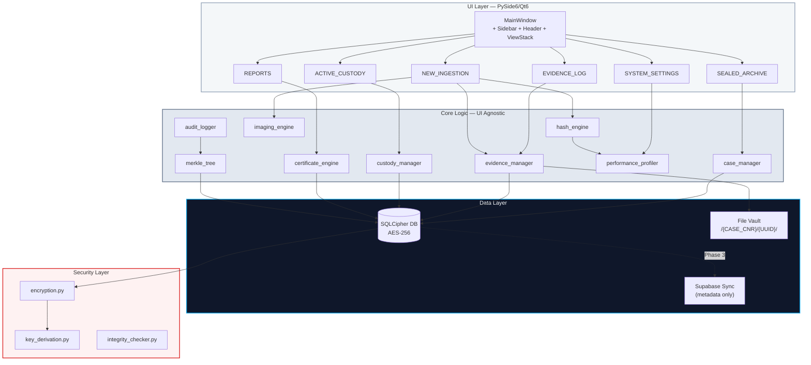
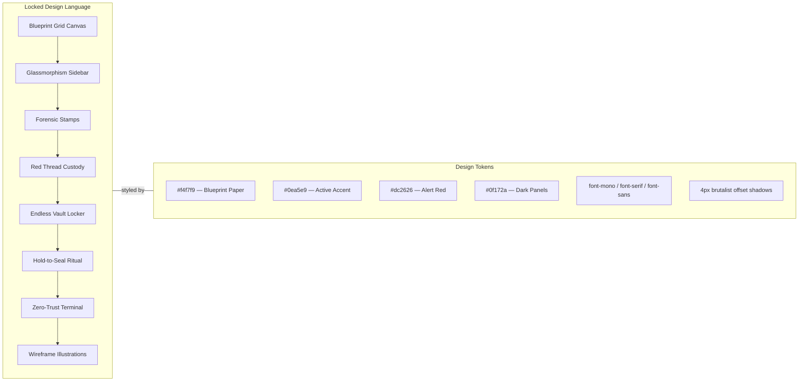
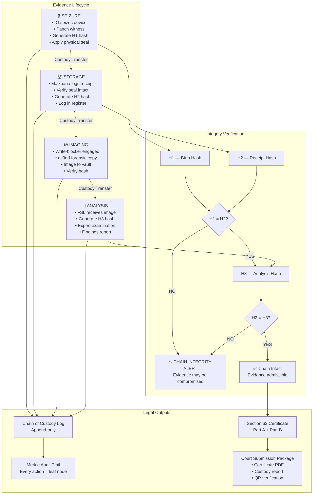
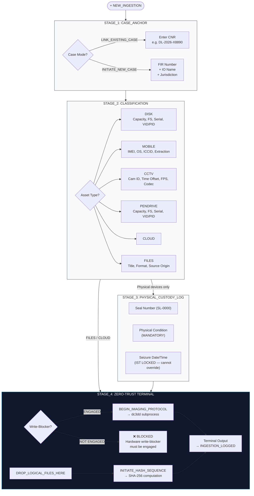
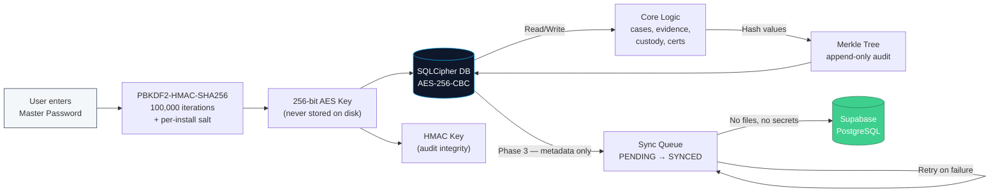

# MALKHANA VAULT — Product Requirements Document

**Version:** 5.0 (Definitive)  
**Classification:** Internal — Architecture & Execution Reference  
**Last Updated:** 2026-04-22  
**Status:** LOCKED after approval  

---

# Table of Contents

- [1. Executive Summary](#1-executive-summary)
- [2. Problem Statement & Vision](#2-problem-statement--vision)
  - [2.1 The Problem](#21-the-problem)
  - [2.2 The Vision](#22-the-vision)
  - [2.3 Legal Anchors](#23-legal-anchors)
- [3. Target Users & Personas](#3-target-users--personas)
  - [3.1 Primary Users](#31-primary-users)
  - [3.2 Secondary Users](#32-secondary-users)
- [4. Product Tiers & Monetization](#4-product-tiers--monetization)
- [5. Feature Specification](#5-feature-specification)
  - [5.1 Core Features (Phase 1)](#51-core-features-phase-1)
  - [5.2 Secondary Features (Phase 2)](#52-secondary-features-phase-2)
  - [5.3 Tertiary Features (Phase 3+)](#53-tertiary-features-phase-3)
- [6. Technical Architecture](#6-technical-architecture)
  - [6.1 Stack Decision](#61-stack-decision)
  - [6.2 System Design — App.jsx ↔ PySide6 Blueprint](#62-system-design--in-depth-appjsx--pythonpyside6-blueprint)
  - [6.3 Application Architecture](#63-application-architecture)
  - [6.4 Database Schema](#64-database-schema-sqlite--sqlcipher)
  - [6.5 Portable Deployment (USB Mode)](#65-portable-deployment-usb-mode)
- [7. Security Architecture](#7-security-architecture)
  - [7.1 Core Security Principles](#71-core-security-principles)
  - [7.2 Encryption Architecture](#72-encryption-architecture)
  - [7.3 Evidence Integrity](#73-evidence-integrity)
  - [7.4 Adaptive Performance Engine](#74-adaptive-performance-engine)
- [8. Development Standards & Coding Conventions](#8-development-standards--coding-conventions)
- [9. Phased Execution Plan](#9-phased-execution-plan)
- [10. Risk Analysis & Mitigation](#10-risk-analysis--mitigation)
- [11. Key Performance Indicators (KPIs)](#11-key-performance-indicators-kpis)
- [12. Competitive Landscape](#12-competitive-landscape)
- [13. Appendix](#13-appendix)
  - [A. Chain of Custody — Complete Workflow](#a-chain-of-custody--complete-workflow)
  - [B. Section 63 Certificate — Field Mapping](#b-section-63-certificate--field-mapping)
  - [C. RBAC Matrix](#c-rbac-matrix)
  - [D. Locked Decisions](#d-locked-decisions)

---

# 1. Executive Summary

Malkhana Vault is an **offline-first, forensically sound digital evidence management system** purpose-built for the Indian legal framework. It automates the chain of custody, evidence ingestion, cryptographic verification, and **BSA Section 63 certificate generation** — the single document that determines whether digital evidence is admissible in Indian courts.

The system is designed as a **custodian, not an analyzer**. It does not perform forensic analysis (that is the domain of Autopsy, FTK, Cellebrite). Instead, it ensures that every piece of digital evidence — from seizure to court submission — is tracked, hashed, sealed, and legally documented with zero gaps in the chain of custody.

**Key Differentiators:**

- First open-source tool built specifically for BSA 2023 compliance (not retrofitted from IEA §65B)
- Offline-first architecture — works in police stations with zero internet
- Portable deployment via USB — usable at crime scenes
- Exact BSA Schedule certificate format (not paraphrased)
- Triple-Hash verification protocol (H1 at seizure → H2 at receipt → H3 at analysis)
- Blueprint/brutalist UI designed for precision and zero ambiguity

**Target Delivery:** 2–3 months for Phase 1 (Linux), phased cross-platform thereafter.

---

# 2. Problem Statement & Vision

## 2.1 The Problem

In the Indian criminal justice system, digital evidence is rejected at an alarming rate due to:

1. **Missing or incorrect Section 63 certificates** — Courts require the exact BSA Schedule format. Most officers don't know how to generate hash values or fill the certificate correctly.

2. **Broken chain of custody** — The "Malkhana Gap": unexplained hours between seizure and FSL receipt where the device's integrity is unverifiable. In 2026, High Courts have held that even a 4-hour unexplained gap is sufficient for exclusion.

3. **No hash at seizure** — Officers seize devices but don't generate H1 (birth hash) at the spot. By the time the device reaches the FSL, there's no baseline to prove data wasn't altered.

4. **Ad-hoc record keeping** — Chain of custody logs are handwritten registers prone to gaps, illegible entries, and tampering.

5. **No integrated workflow** — Officers must use separate tools for imaging (dc3dd), hashing (sha256sum), certificate drafting (Word), and custody logging (paper register). No single system connects these steps.

## 2.2 The Vision

**A single application that a police officer can plug into a USB, boot at a crime scene, and within minutes: seize evidence with a hash, log the custody chain, generate a legally valid Section 63 certificate, and export a court-ready package — all without internet.**

The system makes it nearly impossible to break the chain of custody because every action is logged, hashed, and immutable from the moment of first contact with evidence.

## 2.3 Legal Anchors

| Statute | Relevance |
|---|---|
| **BSA §63** (Bharatiya Sakshya Adhiniyam, 2023) | Admissibility of electronic records; certificate requirement |
| **BSA §63(4)** | Mandatory certificate in BSA Schedule format at each submission |
| **BSA §39** | Definition of "expert" — impacts Part B certificate signatory |
| **BNSS §153** | Seizure powers; chain of custody as statutory document |
| **IT Act §79A** | Examiner of Electronic Evidence designation |
| **2026 National Cyber Forensic Protocol** | Form CC-1 mandatory chain of custody document |

---

# 3. Target Users & Personas

## 3.1 Primary Users

### Persona A: Investigating Officer (IO)

- **Who:** Police sub-inspector to inspector rank
- **Context:** Arrives at a crime scene, seizes a mobile phone or hard drive
- **Pain:** Doesn't know how to generate hash values, fill Section 63 certificate, or maintain digital chain of custody
- **Need:** One-click seizure logging with auto-hash and auto-certificate

### Persona B: Malkhana In-Charge (Custodian)

- **Who:** Police constable or head constable managing the property room
- **Context:** Receives seized devices, stores them, transfers to FSL
- **Pain:** Paper register system with no way to verify seal integrity or track custody gaps
- **Need:** Digital Malkhana with coordinate-based storage tracking and custody transfer logging

### Persona C: FSL Examiner (Forensic Expert)

- **Who:** Forensic Science Laboratory examiner handling digital evidence
- **Context:** Receives forensic images, performs analysis, signs Part B of certificate
- **Pain:** No standardized system to verify H1 matches H2 upon receipt, fragmented certificate workflow
- **Need:** Hash verification dashboard, Part B signing workflow, examination report templates

### Persona D: Private Forensic Consultant

- **Who:** Independent forensic examiner hired by defense or prosecution
- **Context:** Verifies chain of custody, audits hash logs, challenges evidence integrity
- **Pain:** No standardized format for custody audit reports
- **Need:** Audit trail viewer, hash comparison tools, exportable custody reports

## 3.2 Secondary Users

### Persona E: Forensic Institute / Academy

- **Who:** Training institutions (NFSU, CDAC, university forensic departments)
- **Context:** Teaching students digital evidence handling procedures
- **Need:** Demo mode with simulated evidence workflows, educational documentation

### Persona F: Court / Judge (Read-Only)

- **Who:** Judicial officers reviewing submitted evidence
- **Context:** Receiving evidence packages with certificates and custody logs
- **Need:** QR-verifiable certificates, clear audit trail exports, tamper-evident seals

---

# 4. Product Tiers & Monetization

## 4.1 Tier Structure

| Tier | Name | Target | Cost |
|---|---|---|---|
| **Tier 0** | Community Edition | Open source, full-featured for individual use | **Free (forever)** |
| **Tier 1** | Station License | Police stations, single-unit deployment | Freemium / Donation |
| **Tier 2** | Lab Edition | FSL / forensic labs with multi-user + sync | Paid (subscription) |
| **Tier 3** | Enterprise | State-level deployment with central dashboard | Custom pricing |

## 4.2 Monetization Strategy

This is primarily a **passion project with social impact**. Monetization is secondary but planned for sustainability:

1. **Open Core** — Core evidence management + certificate generation is always free and open source
2. **Paid Add-ons** — Multi-user sync (Supabase), enterprise audit dashboard, priority support
3. **Training & Certification** — Partnering with forensic academies (NFSU, CDAC) for certified training programs
4. **Government Procurement** — State police tenders for station-wide deployment after establishing credibility
5. **Forensic Consultant Marketplace** — Future: connecting evidence submitters with certified Part B experts

> [!NOTE]
> Monetization is explicitly Phase 4+. The immediate focus is building a tool that works perfectly and establishing credibility in the forensic community.

---

# 5. Feature Specification

## 5.1 Core Features (Phase 1)

### F1: Case Management

- Create new cases with FIR number, CNR, IO details, jurisdiction
- Link to existing cases via CNR (with format auto-validation per state)
- Case dashboard showing all linked evidence, custody events, certificates
- Case search by CNR, FIR number, IO name, date range

### F2: Evidence Ingestion

- **File-based ingestion** (Phase 1 priority): Hash any file (PDF, image, video, document)
- Capture metadata: file name, format, source origin, file size
- Auto-generate SHA-256 hash at ingestion (H1 — birth hash)
- Optional dual-hash (MD5 + SHA-256) as per BSA recommendation
- Seal number assignment and physical condition logging
- Timestamp locked to system IST (non-overridable)

### F3: Chain of Custody Logging

Every custody event records:

- **From** → **To** (person name, designation, organization)
- **Date & Time** (IST, 24-hour, auto-captured)
- **Purpose** (Seizure / Storage / Analysis / Transport / Court Submission / Return)
- **Seal Number** and **Seal Status** (Intact / Broken / Re-sealed)
- **Hash Verification** at each transfer (H1 → H2 → H3 protocol)
- **Physical Condition** (mandatory text field)
- **Location** (station/lab/court)
- **Panch Witness Details** (name, address — for seizure events)
- **Remarks**

> [!IMPORTANT]
> The Triple-Hash Protocol:
>
> - **H1 (Birth Hash):** Generated at seizure/ingestion — proves original state
> - **H2 (Receipt Hash):** Generated when custody transfers — proves no alteration during transport
> - **H3 (Analysis Hash):** Generated before forensic examination — proves no alteration during storage
>
> If H1 ≠ H2 at any transfer point, the system flags a **CHAIN INTEGRITY ALERT** — evidence may have been compromised during the gap.

### F4: Section 63 Certificate Engine

- **Exact BSA Schedule format** — sourced from `_reference/BSA Section 63 Certificate.pdf`
- **Part A** (Person in Charge / IO / Custodian):
  - Device identification and description
  - Manner of production
  - Declaration of regular use and proper operation
  - Hash value with algorithm checkbox (MD5 / SHA-1 / SHA-256)
  - Signed by person in charge of the device
- **Part B** (Expert):
  - Independent verification of electronic record
  - Hash verification confirmation
  - Expert qualifications and designation
  - Signed by expert (flexible — system allows same or different person)
- **Hash Report Annexure**: Auto-generated, attached to certificate
  - File name, hash algorithm, hash value, timestamp (IST)
- **Signature types**: Typed (Phase 1), Scanned image (Phase 1), DSC (Phase 3)
- **Immutability**: Once both parts are signed → PDF generated → document hash sealed → no further edits
- **QR Code**: Embedded in printed certificate encoding certificate UUID + hash + timestamp

### F5: File Vault (Designated Storage)

- Evidence files organized by case hierarchy: `/{CASE_CNR}/{EVIDENCE_UUID}/`
- Original files stored with read-only permissions
- Forensic images stored separately from originals
- Hash manifest file alongside each evidence item
- No delete operations — ever. Only append.
- Vault location configurable (XDG data path or external drive)

### F6: Search & Retrieval

- Global search across cases, evidence, custody logs, certificates
- Search by: CNR, FIR number, evidence ID, hash value, person name, date range, device type, seal number
- Coordinate-based search in Sealed Archive Matrix (as in UI)
- Results with relevance ranking and quick-jump to source

## 5.2 Secondary Features (Phase 2)

### F7: Forensic Imaging Interface

- Write-blocker verification before imaging
- dc3dd integration (primary), dd fallback
- Live terminal output during imaging process
- Hash computed simultaneously during imaging
- Support for E01, raw/dd output formats

### F8: Advanced Custody Board

- Visual custody trace (pin-board style, as in UI)
- Chronological thread of all personnel handling evidence
- Integration with personnel directory (name, designation, org, clearance level)
- Red-thread visualization connecting custody chain

### F9: Sealed Archive Matrix

- Digital twin of the physical Malkhana
- Coordinate-based grid (Row × Column) mapping to physical storage
- Search-to-locate: type case ID → grid highlights physical location
- Printable barcode labels for physical evidence bags
- Storage condition tracking

### F10: Device-Specific Evidence Types

- **Mobile**: IMEI, model, OS, ICCID, extraction type (Logical/Physical/FS)
- **CCTV/DVR**: Camera ID, location, time offset to IST, FPS, codec
- **Disk/SSD**: Capacity, filesystem, serial, interface type
- **USB/Pendrive**: Volume label, VID/PID, capacity, write-protect status
- **Cloud**: Account ID, IP, timezone, download checksum

## 5.3 Tertiary Features (Phase 3+)

### F11: Beyond Physical Devices

- Screenshots / screen recordings (with metadata capture)
- Email exports (.eml, .pst)
- Server/application logs
- IoT device data
- Cryptocurrency / blockchain records

### F12: Multi-Language Certificates

- English (Phase 1, locked)
- Hindi (Phase 3)
- Bilingual mode (both languages on same page)

### F13: Supabase Sync

- Queue-based sync engine
- Metadata only (case ID, evidence UUID, hash, custody logs)
- No file paths, no secrets, no evidence files in cloud
- Conflict handling: latest wins, previous versions preserved
- Offline-tolerant with retry logic

### F14: Report Templates

- FSL examination request forms
- Court submission cover sheets
- Evidence return/disposal receipts
- Custody audit reports

### F15: Merkle Audit Trail

- Every system action = leaf node in Merkle tree
- Merkle root exportable and independently verifiable
- Optional anchoring to OpenTimestamps (public timestamping)

---

# 6. Technical Architecture

## 6.1 Stack Decision

| Layer | Choice | Rationale |
|---|---|---|
| **Language** | Python 3.11+ | Rapid iteration, cross-platform, forensic tool ecosystem |
| **UI Framework** | PySide6 / Qt6 | Native desktop, Flatpak/AppImage support, cross-platform |
| **Primary DB** | SQLite + SQLCipher | Local-first, encrypted at rest for sensitive data |
| **Sync Layer** | Supabase (PostgreSQL) | Optional, metadata-only cloud sync |
| **Authentication** | Supabase Auth (when synced) | Multi-user access control |
| **Hashing** | hashlib (stdlib) | SHA-256, SHA-512, MD5 — no external dependencies |
| **Imaging** | dc3dd / dd (subprocess) | Industry-standard forensic imaging |
| **PDF Generation** | ReportLab / WeasyPrint | Certificate and report PDF output |
| **QR Codes** | qrcode (Python lib) | Certificate verification codes |
| **Environment** | Python venv | Clean dependency isolation |
| **Linter** | Ruff | Replaces Black + Flake8 + isort |
| **Testing** | pytest | Industry standard |
| **CI/CD** | GitHub Actions | Automated testing, packaging |
| **Packaging** | Flatpak / AppImage | Linux distribution |

> [!IMPORTANT]
> **The React/Vite UI (`App.jsx`) is the canonical design reference.** The production application is built in Python/PySide6, but **the base UI design is locked and must not be changed**. The blueprint/brutalist aesthetic, the 6 core views, the component layouts, the interaction patterns — all of it is preserved 1:1 in the Qt translation. **Only additions are accepted; no modifications to the existing design.**

### System Architecture Overview



### UI Design Preservation Mandate

> [!CAUTION]
> **The following creative design elements are LOCKED.** They represent deliberate aesthetic choices that were meticulously crafted. Every element listed below MUST be faithfully translated from the React/CSS implementation into PySide6/QSS. No simplification, no "good enough" substitutes, no removing animations for convenience.

**The Blueprint Grid Canvas** — The entire application sits on a hand-drafted engineering blueprint aesthetic. This is achieved via two overlaid CSS grids:
- **Minor grid**: 20px spacing, `rgba(100,116,139, 0.15)` — creates the fine graph paper texture
- **Major grid**: 100px spacing, `rgba(100,116,139, 0.3)` — creates the bold section lines
- **Decorative protractor/compass**: Bottom-left SVG with concentric circles, angle marks, degree labels (`0.0°`, `90.0°`) — gives the feeling of a technical drawing workspace
- **Registration marks**: Small `┌ ┐ └ ┘` corner marks on every card, modal, and panel — these are NOT decorative borders, they are precision registration marks from printing/engineering

**The Glassmorphism Sidebar** — The sidebar is semi-transparent (`bg-[#f4f7f9]` with `bg-opacity-50`) creating a frosted-glass effect against the blueprint grid. It must feel like a floating glass panel with:
- Dark avatar block for `OPERATOR_092` identity
- Navigation items that activate with a subtle `bg-[#e2e8f0]` highlight and brutalist offset shadow
- The `NEW_INGESTION` button pinned to the bottom with mechanical click feedback (`active:translate-y-[2px]`)

**The Red Thread (ACTIVE_CUSTODY)** — A physical red string connecting custody personnel cards on a pin-board:
- Primary thread: `#b91c1c` (dark red, 3.5px) with drop shadow — gives depth like an actual string
- Highlight thread: `#ef4444` (bright red, 1.5px) that pulses on hover — shows the active trace
- Metal pin heads at each node: concentric circles (`#334155` → `#94a3b8` → `#f8fafc`) with a spinning dashed red orbit
- Cards are freely positioned with slight rotations (`rot: -3, 4, -2, 1`) — like pinned photos on a corkboard
- `L.END` label at thread terminus like a tag on a string

**The Forensic Stamps (EVIDENCE_LOG)** — Circular rubber-stamp overlays on evidence cards:
- Outer ring: dashed circle with `FORENSIC CONTROL` text following an SVG text path
- Inner ring: solid circle
- Center banner: status text (`STATUS: IMMUTABLE`, `STATUS: ALERT`)
- Blue stamps: `text-slate-600` — normal sealed evidence
- Red stamps: `text-red-700` with 4s pulse animation — active alerts
- Stamps are rotated at angles (`-rotate-12`, `rotate-12`, `-rotate-6`) for realism

**The Endless Vault Locker (SEALED_ARCHIVE)** — A massive 10×15 grid of physical evidence drawers:
- Each drawer is a `border h-16` cell with a centered metal handle (`w-6 h-1.5 border bg-slate--200 shadow-inner`)
- Row/Column axis labels (`R1`–`R10`, `C1`–`C15`) like a library catalog
- Type-to-search dims the entire wall to 20% opacity and grayscale, EXCEPT matched drawers which scale up to 115%, glow sky-blue, and pulse
- Transition timing: `duration-700 ease-[cubic-bezier(0.2,0.8,0.2,1)]` — slow, dramatic reveal
- Clicking a drawer opens a full modal with crosshair target lines, asset wireframe, and brutalist export button

**The Hold-to-Seal Ritual (REPORTS)** — The certificate signing is deliberately ceremonial:
- `AUTHORIZATION PLINTH` — dark bar at the bottom that feels like a bank vault control
- Hold the `HOLD_TO_SEAL` button → progress bar fills from left → on 100% the document is sealed
- `IMMUTABLE_RECORD` red stamp drops with animation on the live certificate preview
- After sealing, the entire left panel greys out with `grayscale pointer-events-none`
- The certificate preview panel uses a dark blueprint bg with cyan grid — a distinct "official document" aesthetic separate from the main app

**The Zero-Trust Terminal (NEW_INGESTION Stage 4)** — A dark terminal embedded in the ingestion wizard:
- Black background with monospace output scrolling sequentially (800ms between lines)
- `root@malkhana-vault-sys:~# system_ready` prompt
- Progress lines with `[~]` prefix, success with `[+]`, hash values with `[!]` highlighted in `#0ea5e9`
- Blinking cursor `_` during processing
- If write-blocker is not engaged: button turns red, pulsing warning text appears

**The Wireframe Illustrations** — Custom SVG isometric/technical drawings of evidence:
- `WireframeSSD`: Isometric 3D view with NAND chip patterns
- `WireframePhone`: Isometric phone with internal circuit traces
- `WireframeDVR`: Front-view DVR rack with channel circles
- `WireframePerson`: Polygonal low-poly human silhouette for custody cards
- All use `strokeWidth` variations and `fillOpacity` for blueprint-like layering



## 6.2 System Design — In-Depth App.jsx ↔ Python/PySide6 Blueprint

> [!IMPORTANT]
> **Every keyword, constant, state variable, and label in `App.jsx` is a direct specification for the production Python codebase.** The naming conventions used in the React reference are the EXACT identifiers to be used in the PySide6 app. This section is the definitive bridge document.

### 6.2.1 View Navigation System

The App.jsx `currentView` state (line 1227) is the master navigation controller. The **exact string constants** used here define the Python enum:

```python
# src/utils/constants.py
from enum import StrEnum

class ViewID(StrEnum):
    EVIDENCE_LOG    = "EVIDENCE_LOG"       # View 1: Card grid of all evidence items
    ACTIVE_CUSTODY  = "ACTIVE_CUSTODY"     # View 2: Pin-board custody trace
    SEALED_ARCHIVE  = "SEALED_ARCHIVE"     # View 3: Physical storage coordinate matrix
    REPORTS         = "REPORTS"            # View 4: Section 63 certificate drafting
    SYSTEM_SETTINGS = "SYSTEM_SETTINGS"    # View 5: Engine config + legal lock
    NEW_INGESTION   = "NEW_INGESTION"      # View 6: 4-stage forensic ingestion wizard
```

**Navigation map (from App.jsx sidebar, lines 1251–1273):**

| Sidebar Label | ViewID Constant | Icon (Lucide → Qt) | Python View Class | Source Component |
|---|---|---|---|---|
| `EVIDENCE_LOG` | `ViewID.EVIDENCE_LOG` | `Archive` | `EvidenceLogView` | `EvidenceCard` (line 162) |
| `ACTIVE_CUSTODY` | `ViewID.ACTIVE_CUSTODY` | `Lock` | `ActiveCustodyView` | `ActiveCustodyBoard` (line 243) |
| `SEALED_ARCHIVE` | `ViewID.SEALED_ARCHIVE` | `ShieldCheck` | `SealedArchiveView` | `SealedArchiveMatrix` (line 486) |
| `REPORTS` | `ViewID.REPORTS` | `FileText` | `ReportsDraftingView` | `ReportsDraftingTable` (line 305) |
| `SYSTEM_SETTINGS` | `ViewID.SYSTEM_SETTINGS` | `Settings` | `SystemSettingsView` | `SystemSettings` (line 737) |
| `NEW_INGESTION` | `ViewID.NEW_INGESTION` | `Plus` | `NewIngestionView` | `NewIngestionWorkflow` (line 905) |

**Secondary navigation (header bar, lines 1281–1287):** Mirrors sidebar but horizontal. Same constants.

**Bottom metrics bar (lines 1336–1357):** Visible only on `EVIDENCE_LOG`, `ACTIVE_CUSTODY`, `SEALED_ARCHIVE`. Metrics:

| Metric Label | Python Accessor |
|---|---|
| `STORAGE_UTILIZATION` | `metrics.storage_usage_tb` |
| `ACTIVE_CUSTODY_ITEMS` | `metrics.active_custody_count` |
| `SEALED_ARCHIVE_COUNT` | `metrics.sealed_archive_count` |
| `SYSTEM_HEALTH_INDEX` | `metrics.system_health_index` |

### 6.2.2 View 1: EVIDENCE_LOG — Evidence Card Grid

**Component:** `EvidenceCard` (line 162)

```python
# EvidenceCard data model
class EvidenceCardData:
    id: str              # e.g. "S50-9926-X1", "MOB-1142-922", "DVR-4402-2Y"
    title: str           # e.g. "1TB_NVME_SSD", "SAMSUNG_S22_ULTRA"
    desc: str            # Description text
    tags: list[str]      # e.g. ["CAPACITY: 1024GB", "INTERFACE: PCIE_X4"]
    image_type: str      # "SSD" | "PHONE" | "DVR" → selects wireframe SVG
    stamp: StampData     # text + type ("blue"|"red") + rotation
    alert: str | None    # e.g. "ENCRYPTION_ACTIVE" (red banner)
```

**Key UI Elements:**
- `VIEW_LOG [ ]` button (line 194) → opens evidence detail
- `INITIATE_NEW_INGESTION` card (line 1321) → navigates to `ViewID.NEW_INGESTION`
- `STAGE 1: SEIZURE WIZARD` subtitle label
- Filter bar: `RECENT` | `HIGH_PRIORITY` buttons (line 1313)
- Evidence stamps: `STATUS: IMMUTABLE` (blue), `STATUS: ALERT` (red)
- Wireframe illustrations: `WireframeSSD`, `WireframePhone`, `WireframeDVR` → Qt SVG widgets

### 6.2.3 View 2: ACTIVE_CUSTODY — Custody Trace Board

**Component:** `ActiveCustodyBoard` (line 243)

**PersonCard data model (line 201):**
```python
class PersonnelNode:
    id: str          # "PER-001"
    name: str        # "J. MILLS"
    role: str        # "SEIZING OFFICER"
    org: str         # "UNIT-9"
    auth: str        # "LEVEL_02" → clearance level
    phone: str       # "EXT-442"
    x: int           # Board X position
    y: int           # Board Y position
    rot: int         # Card rotation degrees
    pin_x: int       # Thread pin-point X
    pin_y: int       # Thread pin-point Y
```

**Visual elements:**
- `threadPath` (line 251) → red SVG bezier curve connecting pins
- Red thread: `stroke="#b91c1c"` primary + `stroke="#ef4444"` highlight
- Animated spin on pin nodes (4s linear infinite)
- `L.END` label at thread terminus
- Personnel labels: `POSITION`, `ORGANIZATION`, `CLEARANCE`
- Hover state: `scale-105`, `shadow-[8px_8px]`, `z-30`

### 6.2.4 View 3: SEALED_ARCHIVE — Coordinate Matrix

**Component:** `SealedArchiveMatrix` (line 486)

**Grid specification:**
- 10 rows × 15 columns = **150 drawers**
- Row labels: `R1`–`R10` | Column labels: `C1`–`C15`
- Drawer ID format: `R{row}-C{col}` (e.g., `R5-C8`)
- Search input placeholder: `ENTER_CASE_ID_OR_CNR`
- Header subtitle: `Physical Storage Twin • Vault Level 3`

**Drawer states (CSS → QSS):**

| State | Condition | Visual |
|---|---|---|
| Empty | `!drawer.caseId` | Transparent, 50% opacity, cursor-not-allowed |
| Occupied | `drawer.caseId` exists | White/60, subtle shadow |
| Search match | `isMatch === true` | Sky-blue bg, `scale-[1.15]`, z-30, shadow, `animate-pulse` |
| Dimmed | `isSearchActive && !isMatch` | 20% opacity, grayscale, non-interactive |

**Modal (line 605):** On drawer click → full detail modal with:
- `ASSET_CLASS` (e.g. SSD, PHONE, DVR)
- `SEIZURE_DATE` (IST formatted)
- `CUSTODIAN_ID` (e.g. `OPR_092`)
- `CRYPTOGRAPHIC_HASH (SHA-256)` (full hash displayed)
- `STORAGE_CONDITION` → `SEAL_INTACT_VERIFIED` with CheckCircle
- `EXPORT_CHAIN_OF_CUSTODY` action button

### 6.2.5 View 4: REPORTS — Section 63 Drafting Table

**Component:** `ReportsDraftingTable` (line 305)

**State model (line 306–313):**
```python
class CertificateDraftState:
    # Part A fields
    custodian_name: str      # OFFICER / CUSTODIAN NAME
    designation: str         # DESIGNATION
    seal_number: str         # SEAL NUMBER
    device_type: str         # "MOBILE_DEVICE" | "COMPUTER_SYSTEM" | "CCTV_DVR_NVR"
    control_type: str        # "MAINTAINED" (default)

    # Part B fields
    examiner_name: str       # EXAMINER NAME
    lab_id: str              # LAB IDENTIFIER (default: "LAB-CYB-09")
    hash_alg: str            # "SHA-256" | "MD5" | "SHA-512"

    # Workflow state
    is_part_a_complete: bool # Gates Part B unlock
    is_signing: bool         # Hold-to-seal in progress
    sign_progress: int       # 0–100 progress bar
    is_locked: bool          # Certificate finalized (immutable)
    final_hash: str          # Document seal hash
```

**Interaction protocol:**
1. Fill Part A fields → `LOCK PART A & PROCEED` button (disabled if missing required)
2. Part B unlocks → fill examiner + lab + hash algorithm
3. `AUTHORIZATION PLINTH` section (dark bg, line 412):
   - `HOLD_TO_SEAL` → pointer-down starts progress bar (3% per 100ms)
   - On 100%: `is_locked = true`, stamp drops `IMMUTABLE_RECORD`
   - Button text changes: `HOLD_TO_SEAL` → `DOCUMENT_IMMUTABLE`
   - Icon changes: `Fingerprint` → `Lock`

**Certificate preview (right panel, line 428):**
- Dark blueprint bg with cyan grid (`rgba(6, 182, 212, 0.1)`)
- Live-updating document with field placeholders like `[CUSTODIAN_NAME]`, `[DESIGNATION]`, `[DEVICE_TYPE]`, `[SEAL_NUM]`, `[EXAMINER_NAME]`, `[LAB_ID]`, `[HASH_ALG]`
- `SECTION 63 B` watermark at 45°
- Annexure: `ANNEXURE_1: HASH_REPORT` table with `FILE_IDENTIFIER`, `ALGORITHM`, `HASH_VALUE`, `TIMESTAMP_IST`
- Hash status: `AWAITING_LOCK...` → actual hash value after seal
- `DOC_SEAL_HASH` bar appears post-lock

**Device categories (from checkboxes, line 372):**
```python
class DeviceCategory(StrEnum):
    COMPUTER_SYSTEM = "COMPUTER_SYSTEM"
    MOBILE_DEVICE   = "MOBILE_DEVICE"
    CCTV_DVR_NVR    = "CCTV_DVR_NVR"
```

### 6.2.6 View 5: SYSTEM_SETTINGS — Engine Architecture

**Component:** `SystemSettings` (line 737)

**This view directly implements the Adaptive Performance Engine (§7.4).** The UI already defines all controls. The state (lines 738–749):

```python
class EngineConfig:
    # SEC_1: FORENSIC_ENGINE_&_TRIAGE
    imager: str            = "dc3dd"       # PRIMARY_IMAGER_DAEMON: "dc3dd" | "dd"
    power_mode: str        = "BALANCED"    # RESOURCE_LOADOUT_METER: "ECO" | "BALANCED" | "TACTICAL"
    gpu_offload: bool      = False         # ENABLE_GPU_OFFLOAD (CUDA/METAL)
    threads: int           = 16            # MULTI_THREAD_HASHING: 1–64 slider
    buffer_size: int       = 4096          # MEMORY_BUFFER_SIZE: 512–16384 MB slider

    # SEC_2: SYNC_&_INTEGRITY
    sync: bool             = True          # SUPABASE_REMOTE_SYNC
    auto_retry: bool       = True          # AUTO_RETRY_PACKET_LOSS
    local_lock: bool       = False         # LOCAL_SECRET_LOCKDOWN

    # SEC_3: WORKFLOW_HIERARCHY
    multi_signer: bool     = True          # REQUIRE_MULTI_SIGNER
    approval_chain: bool   = True          # ENFORCE_APPROVAL_CHAIN
```

**RESOURCE_LOADOUT_METER → Performance Profile mapping:**

| UI Mode | PRD Profile | TACTICAL styling |
|---|---|---|
| `ECO` | Minimal | Default bg |
| `BALANCED` | Standard | Dark bg |
| `TACTICAL` | Workstation | `bg-red-700` (danger aesthetic) |

**AUTO_OPTIMIZE_TO_HOST button (line 751):** Maps to `performance_profiler.py` → auto-detects hardware and sets:
- `powerMode → "TACTICAL"`
- `gpuOffload → true`
- `threads → 64`
- `bufferSize → 16384`

**THE BEDROCK: LEGAL_COMPLIANCE_LOCK (line 877):**

These are **read-only** values — the UI uses `DisabledInput` component (greyed out, `pointer-events-none`):

```python
# These are constants, not configurable
LEGAL_CONSTANTS = {
    "JURISDICTION_TIMEZONE":       "UTC+05:30 (IST_FIXED)",
    "TEMPORAL_FORMAT":             "24_HOUR_MILITARY",
    "REQUIRED_DOCUMENT_TEMPLATE":  "SEC_63_BSA_2023",
    "DATA_MUTABILITY_STATE":       "APPEND_ONLY_STRICT",
}
```

> [!CAUTION]
> Modification of LEGAL_COMPLIANCE_LOCK values requires `Judicial Subpoena Override`. This is enforced at the code level — these values are hardcoded constants, not database entries.

### 6.2.7 View 6: NEW_INGESTION — Forensic Ingestion Protocol

**Component:** `NewIngestionWorkflow` (line 905)

This is the most complex view — a **4-stage sequential wizard**:

**Stage 1: CASE_ANCHOR (line 1004)**

Toggle switch: `LINK_EXISTING_CASE` ↔ `INITIATE_NEW_CASE`

| Mode | Fields |
|---|---|
| `EXISTING` | `cnr` (Computerized Node Record) |
| `NEW` | `fir` (FIR/Crime Number), `io` (Investigating Officer), `jurisdiction` (Station) |

**Stage 2: CLASSIFICATION (line 1040)**

Asset type grid — 6 buttons, each selecting an `AssetType`:

```python
class AssetType(StrEnum):
    DISK     = "DISK"       # HardDrive icon
    MOBILE   = "MOBILE"     # Smartphone icon
    CCTV     = "CCTV"       # Video icon
    PENDRIVE = "PENDRIVE"   # Usb icon
    CLOUD    = "CLOUD"      # Cloud icon
    FILES    = "FILES"      # FileCode2 icon — has amber indicator dot
```

**Dynamic form fields per asset type:**

| AssetType | Fields |
|---|---|
| `FILES` | `fileName`, `fileFormat`, `fileSource` (amber border, warning aesthetic) |
| `MOBILE` | `IMEI`, `OS TYPE/VERSION`, `ICCID (SIM)`, `EXTRACTION GOAL` (`LOGICAL`\|`PHYSICAL`\|`FILE_SYSTEM`) |
| `DISK` / `PENDRIVE` | `CAPACITY SIZE`, `FILESYSTEM DETECTED`, `SERIAL NUMBER`, `VID/PID` |
| `CCTV` | `CAMERA ID / LOCATION`, `TIME OFFSET TO IST`, `NATIVE FPS`, `CODEC FORMAT` |
| `CLOUD` | (no additional fields in current UI) |

Placeholder when nothing selected: `AWAITING_CLASSIFICATION_INPUT`

**Stage 3: PHYSICAL_CUSTODY_LOG (line 1111)**

Only visible for physical devices (`DISK`, `MOBILE`, `CCTV`, `PENDRIVE` — NOT `FILES` or `CLOUD`):

- `sealNum` → Huge centered input with `SL-0000` placeholder, 4xl monospace
- `condition` → Physical condition textarea (mandatory, red borders when empty)
- `DATE/TIME OF SEIZURE (IST FIXED)` → Read-only, system-generated. Label: `SYSTEM TIME LOCKED. CANNOT BE OVERRIDDEN.`

**Stage 4: ZERO-TRUST TERMINAL (line 1142)**

Terminal section with dark bg (`bg-slate-900`):

| AssetType | Pre-terminal UI | Action Button Label |
|---|---|---|
| `FILES` | `DROP_LOGICAL_FILES_HERE` (dashed upload zone) | `INITIATE_HASH_SEQUENCE` |
| Physical devices | `SOURCE BLOCK DEVICE` select + `WRITE_BLOCKER_ENGAGED` checkbox | `BEGIN_IMAGING_PROTOCOL` |

**Write-blocker enforcement:** If `writeBlocker === false` for physical devices:
- Action button: red disabled state (`bg-red-900/20`)
- Warning text: `! HARDWARE WRITE-BLOCKER MUST BE ENGAGED BEFORE IMAGING !` (pulsing)

**Terminal output (line 1178):** Simulated sequential log:
```
root@malkhana-vault-sys:~# system_ready
Awaiting ingestion command sequence...
[SYSTEM] Connecting to secure ingestion daemon...
[+] Ingesting designated logical files...
[+] Target: UNKNOWN_FILE.DAT
[+] Allocating memory buffer...
[+] Calculating cryptographic hash (SHA-256)...
[~] Hashing... 45%
[~] Hashing... 100%
[!] SHA-256: 8d969eef6ecad3c29a3a629280e686cf0c3f5d5a86aff3ca12020c923adc6c92
[+] Committed to immutable ledger. Ingestion complete.
```

**Button states:** `INITIATE_HASH_SEQUENCE` → `PROCESSING_SEIZURE...` → `INGESTION_LOGGED`

### 6.2.8 Shared Components — Python Widget Map

| App.jsx Component | Python Widget | Purpose |
|---|---|---|
| `BlueprintBackground` (line 31) | `BlueprintBackgroundWidget` | Full-window SVG grid + decorative elements |
| `Stamp` (line 135) | `ForensicStampWidget` | Circular stamp with `FORENSIC CONTROL` text path |
| `EvidenceCard` (line 162) | `EvidenceCardWidget` | Evidence item card with corners, tags, wireframe |
| `PersonCard` (line 201) | `PersonnelCardWidget` | Custody personnel card |
| `IndCheckbox` (line 295) | `IndustrialCheckbox` | Blueprint-styled checkbox |
| `IndustrialToggle` (line 711) | `IndustrialToggleWidget` | On/off toggle with glow effect |
| `DisabledInput` (line 730) | `LockedInputWidget` | Read-only greyed out field |
| `AssetButton` (line 976) | `AssetTypeButton` | Square icon button for classification |
| `WireframeSSD` (line 57) | `WireframeSSDWidget` | SVG isometric SSD illustration |
| `WireframePhone` (line 73) | `WireframePhoneWidget` | SVG isometric phone illustration |
| `WireframeDVR` (line 86) | `WireframeDVRWidget` | SVG front-view DVR illustration |
| `WireframePerson` (line 109) | `WireframePersonWidget` | SVG polygonal person illustration |

### 6.2.9 User Identity & Global State

**Sidebar user block (lines 1241–1248):**
```python
class OperatorIdentity:
    user_label: str = "USER\n092"       # Displayed in avatar block
    operator_id: str = "OPERATOR_092"   # Sidebar label
    unit: str = "FORENSIC CENTRAL"      # Subtitle
```

**Global search bar (line 1292):** Placeholder: `GLOBAL_CASE_SEARCH`. Hidden when `currentView === 'SEALED_ARCHIVE'` (that view has its own target search).

**Header toolbar buttons (lines 1297–1298):** `ScanLine` icon (barcode scan), `History` icon (activity log).

**App title (line 1280):** `MALKHANA_VAULT` — font-black, tracking-widest.

### 6.2.10 Design Tokens (from App.jsx)

| Token | Value | Usage |
|---|---|---|
| `COLOR_BG_PRIMARY` | `#f4f7f9` | Main background (blueprint paper) |
| `COLOR_BG_ACTIVE` | `#e2e8f0` | Active sidebar item, section headers |
| `COLOR_BORDER` | `border-slate-400` | Standard 1px solid borders |
| `COLOR_ACCENT` | `#0ea5e9` | Certificate preview, terminal highlights, active states |
| `COLOR_ALERT` | `#dc2626` | Integrity warnings, chain breaks |
| `COLOR_STAMP_BLUE` | `text-slate-600` | Immutable status stamp |
| `COLOR_STAMP_RED` | `text-red-700` | Alert status stamp |
| `COLOR_DARK_BG` | `#0f172a` | Certificate preview panel, terminal |
| `COLOR_CERT_BG` | `#e0f2fe` | Certificate document background |
| `COLOR_CERT_BORDER` | `#0284c7` | Certificate document border |
| `GRID_MINOR` | 20px, `rgba(100,116,139, 0.15)` | Minor blueprint grid |
| `GRID_MAJOR` | 100px, `rgba(100,116,139, 0.3)` | Major blueprint grid |
| `SHADOW_BRUTALIST` | `4px 4px 0px rgba(100,116,139,0.1)` | Card shadow |
| `SHADOW_BRUTALIST_HEAVY` | `8px 8px 0px rgba(30,41,59,1)` | Modal/bedrock shadow |
| `FONT_DATA` | `font-mono` | Hash values, IDs, codes |
| `FONT_LEGAL` | `font-serif` | Certificate body text |
| `FONT_UI` | `font-sans` | Labels, navigation |
| `CORNER_MARK` | `2px border-t border-l` | Registration marks on cards, modals |

### 6.2.11 Interaction Patterns (must be preserved in PySide6)

| Pattern | App.jsx Implementation | Python/Qt Equivalent |
|---|---|---|
| **Hold-to-seal** | `onPointerDown` starts timer → `signProgress` increments → on 100% → `isLocked=true` (line 418) | `QTimer` on `mousePressEvent`, stop on `mouseReleaseEvent` |
| **Search-to-locate** | Type in search → drawers dim/highlight with `transition-all duration-700` (line 576) | `QLineEdit.textChanged` → `QPropertyAnimation` on grid cells |
| **Hover-to-trace** | Hover `PersonCard` → thread pulses, card scales (line 205) | `enterEvent`/`leaveEvent` → `QPropertyAnimation` |
| **Stage gating** | Part B locked until Part A complete (line 384) | `setEnabled(False)` on Part B `QGroupBox` |
| **Write-blocker gate** | Imaging button disabled until `writeBlocker === true` (line 1198) | `QPushButton.setEnabled()` bound to checkbox state |
| **Crosshatch invalid** | Missing required fields → red diagonal stripe bg (line 333) | QSS `background: repeating-linear-gradient(-45deg, ...)` |
| **Terminal auto-scroll** | `useEffect` → `scrollTop = scrollHeight` (line 926) | `QTextEdit.moveCursor(QTextCursor.End)` on append |
| **Stamp animation** | CSS `animate-[stamp-drop_0.4s]` (line 464) | `QPropertyAnimation(opacity + scale)` |

## 6.3 Application Architecture

```
malkhana-vault/
├── src/
│   ├── main.py                     # Entry point, app initialization
│   ├── app.py                      # QApplication setup, main window
│   │
│   ├── ui/                         # All UI components (PySide6)
│   │   ├── main_window.py          # Main window with sidebar + view stack
│   │   ├── components/             # Reusable UI components
│   │   │   ├── blueprint_bg.py     # Blueprint grid background widget
│   │   │   ├── stamp.py            # Forensic stamp widget
│   │   │   ├── corner_marks.py     # Registration corner mark widget
│   │   │   ├── industrial_toggle.py
│   │   │   ├── search_bar.py
│   │   │   └── status_bar.py
│   │   ├── views/                  # 6 core views
│   │   │   ├── evidence_log.py
│   │   │   ├── active_custody.py
│   │   │   ├── reports_drafting.py
│   │   │   ├── sealed_archive.py
│   │   │   ├── system_settings.py
│   │   │   └── new_ingestion.py
│   │   ├── dialogs/                # Modal dialogs
│   │   │   ├── evidence_detail.py
│   │   │   ├── custody_transfer.py
│   │   │   └── certificate_preview.py
│   │   └── styles/                 # QSS stylesheets
│   │       ├── blueprint.qss       # Core blueprint theme
│   │       └── tokens.py           # Design token constants
│   │
│   ├── core/                       # Business logic (UI-agnostic)
│   │   ├── case_manager.py         # Case CRUD operations
│   │   ├── evidence_manager.py     # Evidence ingestion + vault operations
│   │   ├── custody_manager.py      # Chain of custody operations
│   │   ├── certificate_engine.py   # Section 63 certificate generation
│   │   ├── hash_engine.py          # Cryptographic hashing (SHA-256, MD5)
│   │   ├── imaging_engine.py       # dc3dd / dd subprocess management
│   │   ├── merkle_tree.py          # Merkle audit trail
│   │   ├── audit_logger.py         # Immutable audit log
│   │   ├── search_engine.py        # Global search across all entities
│   │   ├── vault_manager.py        # File vault operations + path management
│   │   ├── performance_profiler.py # Hardware detection + adaptive profile engine
│   │   ├── pdf_generator.py        # PDF output (certificates, reports)
│   │   ├── qr_generator.py         # QR code for certificates
│   │   └── time_authority.py       # IST time management + NTP verification
│   │
│   ├── data/                       # Data layer
│   │   ├── database.py             # SQLite/SQLCipher connection management
│   │   ├── models.py               # Data models (dataclasses)
│   │   ├── schema.py               # Schema definitions + migrations
│   │   ├── repository.py           # Data access layer (queries)
│   │   └── sync/                   # Supabase sync (Phase 3)
│   │       ├── sync_engine.py
│   │       ├── sync_queue.py
│   │       └── conflict_resolver.py
│   │
│   ├── security/                   # Security module
│   │   ├── encryption.py           # SQLCipher key management
│   │   ├── key_derivation.py       # KDF for master password → DB key
│   │   ├── integrity_checker.py    # Hash verification + chain validation
│   │   └── auth.py                 # Local auth (master password)
│   │
│   └── utils/                      # Shared utilities
│       ├── constants.py            # App-wide constants
│       ├── xdg_paths.py            # XDG directory resolution
│       ├── validators.py           # CNR format, input validation
│       ├── formatters.py           # Date/time formatting (IST)
│       └── logging_config.py       # Structured logging setup
│
├── assets/
│   ├── icons/                      # App icons (scalable SVG)
│   ├── fonts/                      # Bundled fonts if needed
│   ├── templates/                  # Certificate templates
│   │   └── section_63_template.json
│   └── org.malkhana.vault.desktop  # Desktop entry
│
├── tests/
│   ├── conftest.py
│   ├── test_hash_engine.py
│   ├── test_certificate_engine.py
│   ├── test_custody_manager.py
│   ├── test_vault_manager.py
│   ├── test_merkle_tree.py
│   └── test_integrity_checker.py
│
├── packaging/
│   ├── flatpak/
│   │   └── org.malkhana.vault.yml
│   └── appimage/
│       ├── AppRun
│       └── AppDir/
│
├── scripts/
│   ├── build.sh
│   └── run_tests.sh
│
├── _reference/                     # Design & legal references (not shipped)
│   ├── PRD.md
│   ├── Foundation.md
│   ├── BSA.pdf
│   ├── BSA Section 63 Certificate.pdf
│   └── App.jsx                     # UI design reference (React mockup)
│
├── .github/workflows/ci.yml
├── .pre-commit-config.yaml
├── pyproject.toml
├── requirements.txt
├── .env.example
├── .gitignore
└── README.md
```

## 6.4 Database Schema (SQLite + SQLCipher)

### Encryption Strategy

- **SQLCipher** for the primary database — all data encrypted at rest
- Master password → PBKDF2 (100,000 iterations) → AES-256 encryption key
- Key never stored on disk — derived at runtime from user's master password
- Unencrypted SQLite fallback for demo/educational mode

### Core Tables

```sql
-- Cases
CREATE TABLE cases (
    id              TEXT PRIMARY KEY,        -- UUID
    cnr             TEXT UNIQUE,             -- Case Number Record
    fir_number      TEXT,
    investigating_officer TEXT NOT NULL,
    jurisdiction    TEXT NOT NULL,
    court           TEXT,
    status          TEXT DEFAULT 'ACTIVE',   -- ACTIVE | CLOSED | ARCHIVED
    created_at      TEXT NOT NULL,           -- ISO 8601, IST
    updated_at      TEXT NOT NULL,
    remarks         TEXT
);

-- Evidence items
CREATE TABLE evidence (
    id              TEXT PRIMARY KEY,        -- UUID
    case_id         TEXT NOT NULL REFERENCES cases(id),
    evidence_number TEXT NOT NULL,           -- Human-readable (e.g., "EVD-001")
    device_type     TEXT NOT NULL,           -- DISK | MOBILE | CCTV | PENDRIVE | CLOUD | FILE
    description     TEXT NOT NULL,
    metadata_json   TEXT,                    -- Device-specific metadata (JSON)
    seal_number     TEXT,
    physical_condition TEXT,
    vault_path      TEXT,                    -- Relative path in file vault
    status          TEXT DEFAULT 'SEIZED',   -- SEIZED | IN_CUSTODY | UNDER_ANALYSIS | SEALED | RETURNED
    seized_at       TEXT NOT NULL,           -- ISO 8601, IST
    seized_by       TEXT NOT NULL,
    created_at      TEXT NOT NULL,
    UNIQUE(case_id, evidence_number)
);

-- Hash records (append-only, never modified)
CREATE TABLE hashes (
    id              TEXT PRIMARY KEY,
    evidence_id     TEXT NOT NULL REFERENCES evidence(id),
    algorithm       TEXT NOT NULL,           -- SHA-256 | MD5 | SHA-512
    hash_value      TEXT NOT NULL,
    hash_type       TEXT NOT NULL,           -- H1_SEIZURE | H2_RECEIPT | H3_ANALYSIS | VERIFICATION
    computed_at     TEXT NOT NULL,           -- ISO 8601, IST
    computed_by     TEXT NOT NULL,
    file_name       TEXT,                    -- Source file name
    file_size       INTEGER,                -- Bytes
    remarks         TEXT
);

-- Chain of custody (append-only)
CREATE TABLE custody_log (
    id              TEXT PRIMARY KEY,
    evidence_id     TEXT NOT NULL REFERENCES evidence(id),
    from_person     TEXT NOT NULL,
    from_designation TEXT,
    from_org        TEXT,
    to_person       TEXT NOT NULL,
    to_designation  TEXT,
    to_org          TEXT,
    purpose         TEXT NOT NULL,           -- SEIZURE | STORAGE | ANALYSIS | TRANSPORT | COURT | RETURN
    seal_number     TEXT,
    seal_status     TEXT,                    -- INTACT | BROKEN | RE_SEALED
    physical_condition TEXT,
    location        TEXT,
    hash_verified   INTEGER DEFAULT 0,      -- Boolean: was hash checked at transfer?
    hash_match      INTEGER,                -- Boolean: did hashes match? NULL if not checked
    panch_witness_1 TEXT,                    -- JSON: {name, address, phone}
    panch_witness_2 TEXT,                    -- JSON: {name, address, phone}
    transferred_at  TEXT NOT NULL,           -- ISO 8601, IST
    remarks         TEXT,
    created_at      TEXT NOT NULL
);

-- Section 63 Certificates
CREATE TABLE certificates (
    id              TEXT PRIMARY KEY,
    evidence_id     TEXT NOT NULL REFERENCES evidence(id),
    case_id         TEXT NOT NULL REFERENCES cases(id),
    
    -- Part A fields
    part_a_name     TEXT,
    part_a_designation TEXT,
    part_a_device_type TEXT,
    part_a_control_type TEXT,                -- OWNED | MAINTAINED | MANAGED | OPERATED
    part_a_seal_number TEXT,
    part_a_signed_at TEXT,
    part_a_signature_type TEXT,              -- TYPED | SCANNED | DSC
    part_a_signature_data TEXT,              -- Base64 for scanned
    
    -- Part B fields
    part_b_name     TEXT,
    part_b_designation TEXT,
    part_b_lab_id   TEXT,
    part_b_hash_algorithm TEXT,
    part_b_signed_at TEXT,
    part_b_signature_type TEXT,
    part_b_signature_data TEXT,
    
    -- Certificate state
    status          TEXT DEFAULT 'DRAFT',    -- DRAFT | PART_A_LOCKED | COMPLETE | SEALED
    pdf_path        TEXT,                    -- Path to generated PDF
    pdf_hash        TEXT,                    -- Hash of the sealed PDF
    qr_data         TEXT,                    -- QR code payload
    sealed_at       TEXT,                    -- Timestamp of final seal
    created_at      TEXT NOT NULL,
    updated_at      TEXT NOT NULL
);

-- Immutable audit log (append-only, never modified, never deleted)
CREATE TABLE audit_log (
    id              TEXT PRIMARY KEY,
    action          TEXT NOT NULL,           -- Action type
    entity_type     TEXT NOT NULL,           -- cases | evidence | custody_log | certificates
    entity_id       TEXT NOT NULL,
    actor           TEXT NOT NULL,           -- Who performed the action
    details_json    TEXT,                    -- Action-specific details
    merkle_hash     TEXT,                    -- Hash of this entry + previous entry
    created_at      TEXT NOT NULL            -- ISO 8601, IST
);

-- Sync queue (for Supabase, Phase 3)
CREATE TABLE sync_queue (
    id              TEXT PRIMARY KEY,
    entity_type     TEXT NOT NULL,
    entity_id       TEXT NOT NULL,
    operation       TEXT NOT NULL,           -- INSERT | UPDATE
    payload_json    TEXT NOT NULL,
    status          TEXT DEFAULT 'PENDING',  -- PENDING | SYNCED | FAILED
    retry_count     INTEGER DEFAULT 0,
    created_at      TEXT NOT NULL,
    synced_at       TEXT
);
```

### Schema Rules

- **No DELETE operations exist in the codebase** — not even soft deletes
- All tables are append-only or update-only (for status changes)
- `audit_log` has a trigger-based Merkle chain: each entry's `merkle_hash` = SHA-256(current_entry + previous_merkle_hash)
- Timestamps are always ISO 8601 in IST (UTC+05:30)
- Schema migrations are versioned and tested

## 6.5 Portable Deployment (USB Mode)

The application supports running directly from a USB drive:

1. **AppImage on USB**: Plug in → Run `./MalkhanaVault.AppImage` → Fully functional
2. **Data on USB**: XDG paths can be overridden via environment variable to store data on the USB itself
3. **Auth levels**: USB deployment uses local auth (master password) — no network required
4. **Use case**: IO at crime scene plugs USB into any Linux machine, generates H1 hash, logs seizure, prints certificate

```
USB_DRIVE/
├── MalkhanaVault.AppImage
├── data/                     # Portable data directory
│   ├── vault.db              # SQLCipher database
│   ├── evidence/             # Evidence file vault
│   └── exports/              # Generated PDFs
└── config/
    └── settings.json         # Portable config
```

---

# 7. Security Architecture

## 7.1 Core Security Principles

1. **No silent failures** — All errors logged with context, critical failures halt operation
2. **Append-only records** — No delete, no overwrite on evidence/custody/audit data
3. **Local secrets only** — No credentials in source code or committed files
4. **Zero-trust evidence handling** — Original device NEVER modified; analysis only on forensic image
5. **Encrypted at rest** — SQLCipher for database, evidence files in permission-controlled vault

## 7.2 Encryption Architecture

```
┌──────────────────────────────────────────┐
│           USER ENTERS MASTER PASSWORD     │
│                    │                      │
│                    ▼                      │
│          PBKDF2-HMAC-SHA256              │
│          (100,000 iterations)            │
│          Salt: per-installation random    │
│                    │                      │
│                    ▼                      │
│          256-bit AES KEY                 │
│                    │                      │
│         ┌──────────┴──────────┐          │
│         ▼                     ▼          │
│    SQLCipher DB          HMAC Key        │
│    (encrypted)        (audit integrity)  │
└──────────────────────────────────────────┘
```

- **Database**: SQLCipher with AES-256-CBC
- **Key derivation**: PBKDF2 with random per-install salt (stored in XDG config)
- **Key storage**: NEVER stored on disk — derived from password at each session
- **Supabase (when enabled)**: Only anon/public keys in client — no service role keys ever

## 7.3 Evidence Integrity

| Mechanism | Purpose |
|---|---|
| SHA-256 hashing | Primary integrity verification |
| Dual-hash (MD5 + SHA-256) | Collision resistance per BSA recommendation |
| Triple-Hash Protocol | H1→H2→H3 at each custody transfer |
| Merkle audit trail | Tamper-evident action log |
| Append-only tables | No historical data can be altered |
| PDF signing | Generated certificates are hash-sealed |
| QR verification | Independent hash check without system access |

## 7.4 Adaptive Performance Engine

The application runs on everything from a 10-year-old police station desktop (2 GB RAM, HDD, single-core) to a high-end FSL workstation (64 GB RAM, NVMe, multi-core GPU). The performance engine **auto-detects hardware at startup** and adapts all resource-intensive operations accordingly.

### Hardware Detection (at startup)

| Detected Parameter | How | Used For |
|---|---|---|
| CPU cores (physical + logical) | `os.cpu_count()` + `psutil` | Worker thread pool sizing |
| Available RAM | `psutil.virtual_memory()` | Buffer/chunk size for hashing |
| Disk type (SSD vs HDD) | `lsblk` / read speed benchmark | I/O strategy (sequential vs parallel reads) |
| GPU presence | `subprocess` probe for OpenCL/CUDA | GPU-accelerated hashing (if available) |
| NPU/accelerator | Platform-specific detection | Future: hardware-accelerated crypto |

### Performance Profiles

> [!NOTE]
> These profiles map directly to the `RESOURCE_LOADOUT_METER` in SYSTEM_SETTINGS (§6.2.6). The `AUTO_OPTIMIZE_TO_HOST` button triggers auto-detection and sets the optimal profile.

| UI Mode (`RESOURCE_LOADOUT_METER`) | Internal Profile | `MULTI_THREAD_HASHING` | `MEMORY_BUFFER_SIZE` | `ENABLE_GPU_OFFLOAD` | Hashing Strategy |
|---|---|---|---|---|---|
| **ECO** | Minimal | 1–2 cores | 512–1024 MB | Off | Sequential, single-thread |
| **BALANCED** (default) | Standard | 4–16 cores | 2048–4096 MB | Off | Multi-threaded chunked hashing |
| **TACTICAL** | Workstation | 16–64 cores | 8192–16384 MB | On (if CUDA/Metal) | Full parallel + GPU hash offload |

### How It Works

1. **Chunked Hashing** — Large evidence files (10 GB+ CCTV footage, disk images) are never loaded into memory whole. The hash engine reads in chunks (`chunk_size` from profile), computes incremental SHA-256 via `hashlib.update()`, and yields progress callbacks for the UI progress bar.

2. **Parallel Pipeline** — On Standard+ profiles, the engine uses a producer-consumer pattern: one thread reads the next chunk from disk while another hashes the current chunk. On HDD systems, this is disabled to avoid thrashing.

3. **Multi-File Parallelism** — When hashing multiple evidence files in a case, each file gets its own worker thread (up to `workers` limit from profile). Low-end systems process files sequentially.

4. **GPU Hash Offload** — On Workstation profile, if OpenCL or CUDA is available, SHA-256 computation is offloaded to the GPU for large files (>1 GB). Falls back gracefully to CPU if GPU is unavailable or driver issues occur.

5. **Memory Pressure Monitoring** — During long operations (imaging, batch hashing), the engine monitors `psutil.virtual_memory().percent`. If memory usage exceeds 85%, it automatically reduces chunk size and pauses non-critical background tasks.

6. **Graceful Degradation** — If the system is too slow for real-time progress, the engine switches to batch mode with periodic checkpoint saves. No data loss even on crash during a long hash operation — the engine resumes from the last checkpoint.

### User Override

The System Settings view allows manual profile selection (override auto-detect). This is useful when:
- Running from USB on an unknown machine
- Sharing resources with other forensic tools
- The user knows the workload characteristics better than the profiler

> [!NOTE]
> The performance profile affects **speed only, never correctness**. A SHA-256 hash computed on a Minimal profile is bit-identical to one computed on a Workstation profile. The legal integrity of the evidence is never compromised by the performance tier.

---

# 8. Development Standards & Coding Conventions

## 8.1 Code Quality Rules

| Standard | Implementation |
|---|---|
| **Formatter** | Ruff (replaces Black) — enforced via pre-commit hook |
| **Linter** | Ruff (replaces Flake8 + isort) |
| **Type Hints** | Mandatory on all function signatures |
| **Docstrings** | Required on all public classes and functions (Google style) |
| **Naming** | `snake_case` for functions/variables, `PascalCase` for classes, `UPPER_SNAKE` for constants |
| **Max line length** | 99 characters |
| **Imports** | Sorted by Ruff (stdlib → third-party → local) |
| **Tests** | Every core module must have corresponding test file |
| **Logging** | `logging` module, structured format, daily rotation |

## 8.2 Architecture Rules (Non-Negotiable)

1. **XDG Base Directory Standard** — All mutable data uses XDG paths, resolved dynamically at runtime. No hardcoded absolute paths.

2. **Agnostic Core** — `src/core/` must NOT import from `src/ui/`. Core logic is UI-framework agnostic. No `APPIMAGE` or `FLATPAK_ID` checks in application code.

3. **Asset and Data Separation** — Static assets loaded relative to application directory. Mutable data uses XDG paths. Never mix.

4. **Secrets Management** — `python-dotenv` for local `.env`. Supabase anon keys only in client. Service role keys NEVER shipped.

5. **Fail Loud** — Missing config → crash at startup, not silent degradation. Missing required fields → block operation, show clear error.

6. **IST Everywhere** — All timestamps in IST (UTC+05:30), 24-hour format, ISO 8601 internally, human-readable in UI.

## 8.3 Git Workflow

- **Branches**: `main` (stable), `dev` (active development), `feature/*` (per-feature)
- **Commits**: Conventional commits (`feat:`, `fix:`, `docs:`, `refactor:`, `test:`)
- **Pre-commit hooks**: Ruff format + lint, pytest (fast suite only)
- **CI**: GitHub Actions on push to `main`/`dev` and on PRs to `main`

---

# 9. Phased Execution Plan

## Phase 1: Foundation & Core (Weeks 1–4)

**Goal:** "Hash a file, log custody, generate a certificate"

- [ ] Project scaffolding (directory structure per §6.3)
- [ ] XDG paths module
- [ ] SQLCipher database setup with schema v1
- [ ] Hash engine (SHA-256, MD5)
- [ ] Case management (create, search, list)
- [ ] Evidence ingestion — file-based hashing
- [ ] Chain of custody logging (basic: from/to/purpose/time)
- [ ] Certificate engine — exact BSA Schedule format from reference PDF
- [ ] PDF generation for certificates
- [ ] QR code on certificates
- [ ] Audit logger (append-only)
- [ ] PySide6 UI: Evidence Log view (from App.jsx design)
- [ ] PySide6 UI: New Ingestion view (file-based only)
- [ ] PySide6 UI: Reports / Section 63 Drafting Table
- [ ] File vault with case-based directory structure
- [ ] Basic search (case ID, evidence ID)
- [ ] Master password auth + SQLCipher key derivation
- [ ] Unit tests for all core modules
- [ ] AppImage packaging for Linux

**Deliverable:** Working Linux app that can hash files, log custody, and produce court-ready Section 63 certificates.

---

## Phase 2: Evidence Lifecycle (Weeks 5–8)

**Goal:** "Full custody chain with device-specific ingestion"

- [ ] PySide6 UI: Active Custody Board view
- [ ] PySide6 UI: Sealed Archive Matrix view
- [ ] PySide6 UI: System Settings view
- [ ] Triple-Hash Protocol (H1, H2, H3 with chain integrity alerts)
- [ ] Device-specific evidence types (Mobile, CCTV, Disk, USB)
- [ ] Seal number tracking + physical condition logging
- [ ] Panch witness integration for seizure events
- [ ] Forensic imaging interface (dc3dd integration)
- [ ] Write-blocker verification
- [ ] Advanced search (full-text across all entities)
- [ ] Barcode label generation for evidence bags
- [ ] Merkle audit trail
- [ ] Export: custody audit report, chain of custody PDF
- [ ] USB portable mode

**Deliverable:** Full evidence lifecycle management with device-specific workflows.

---

## Phase 3: Multi-User & Sync (Weeks 9–12)

**Goal:** "Lab-grade multi-user deployment"

- [ ] Supabase sync engine (metadata-only)
- [ ] Role-Based Access Control (RBAC)
- [ ] Multi-user certificate workflow (Part A → Part B by different users)
- [ ] DSC (Digital Signature Certificate) integration
- [ ] Hindi certificate template
- [ ] Report templates (FSL request, court cover sheet, disposal receipt)
- [ ] Beyond-physical evidence types (screenshots, emails, server logs)
- [ ] Time authority verification (NTP check on startup)
- [ ] Flatpak packaging
- [ ] Integration tests + CI pipeline hardening

**Deliverable:** Multi-user forensic lab deployment with cloud sync.

---

## Phase 4: Scale & Monetize (Month 4+)

**Goal:** "Enterprise readiness"

- [ ] Cross-platform: Windows packaging (MSIX / installer)
- [ ] Enterprise audit dashboard
- [ ] RFID support for automated custody tracking
- [ ] Blockchain / OpenTimestamps hash anchoring
- [ ] Training mode / demo mode for forensic academies
- [ ] Monetization infrastructure (license management)
- [ ] macOS packaging
- [ ] External tool plugin API (Autopsy, FTK report import)

---

# 10. Risk Analysis & Mitigation

| # | Risk | Severity | Probability | Mitigation |
|---|---|---|---|---|
| R1 | **Certificate format rejected by court** | Critical | Medium | Use exact BSA Schedule template from official PDF. No paraphrasing. Legal review before v1.0 |
| R2 | **Chain of custody gap** | Critical | High | Mandatory fields on every transfer. System blocks operations if required fields missing. Triple-hash protocol flags discrepancies |
| R3 | **Evidence tampering** | Critical | Low | Append-only DB, Merkle audit trail, SHA-256 hashing at every stage, SQLCipher encryption |
| R4 | **System clock manipulation** | High | Medium | NTP verification on startup (warning if clock drifts >5s), IST locked, no user-overridable timestamps |
| R5 | **Lost USB / portable deployment** | High | Medium | SQLCipher encryption — database is unreadable without master password even if USB is stolen |
| R6 | **"Expert" definition changes** | Medium | High | Flexible Part B workflow — system allows same person or different person to sign. Easily adaptable when courts settle interpretation |
| R7 | **Hash collision (MD5)** | Medium | Low | Dual-hash strategy (MD5 + SHA-256). SHA-256 is primary; MD5 for BSA backward compatibility |
| R8 | **Cloud sync failure** | Low | Medium | Offline-first design — cloud is always optional. Queue-based sync with retry logic |
| R9 | **Data loss** | Critical | Low | Built-in backup/restore. Vault data integrity checks. Export to external media |
| R10 | **Scope creep** | Medium | High | Phased execution plan. Phase 1 is minimal viable legal product. No feature added without addressing a real legal workflow gap |

---

# 11. Key Performance Indicators (KPIs)

## Technical KPIs

| Metric | Target |
|---|---|
| Hash computation speed (1 GB file) | < 30 seconds |
| Certificate PDF generation time | < 3 seconds |
| Application cold start time | < 5 seconds |
| Database query response (10K records) | < 100ms |
| Memory usage (idle) | < 150 MB |
| AppImage size | < 200 MB |

## Product KPIs (Post-Launch)

| Metric | Target (6 months) |
|---|---|
| Certificates generated | 500+ |
| Forensic labs using the tool | 5+ |
| GitHub stars | 200+ |
| Community contributors | 10+ |
| Certificate court acceptance rate | 100% (zero rejections due to format) |

## Legal Compliance KPIs

| Metric | Target |
|---|---|
| BSA Schedule format accuracy | 100% match to official template |
| Chain of custody gap alerts | Zero false negatives |
| Audit trail integrity | 100% verifiable Merkle chain |
| Hash verification success rate | 100% (H1=H2=H3 when evidence is untampered) |

---

# 12. Competitive Landscape

## 12.1 Existing Solutions

| Product | Type | India-Specific? | BSA §63 Support | Chain of Custody | Offline? | Cost |
|---|---|---|---|---|---|---|
| **Cellebrite Guardian** | Enterprise DEM | No | No | Yes | No | $$$$ |
| **OpenText DEM** | Enterprise DEM | No | No | Yes | No | $$$$ |
| **Magnet AXIOM** | Forensic Suite | No | No | Partial | Partial | $$$ |
| **Autopsy** | Open Source Forensic | No | No | No | Yes | Free |
| **FTK** | Forensic Suite | No | No | Partial | Partial | $$$ |
| **Cyber Forensic Toolkit (Pendrive)** | USB Toolkit | India | No | No | Yes | $$ |
| **0xRuchiKaraShunti** | GitHub Project | India | No | Yes (IPFS) | Partial | Free |
| **Malkhana Vault** | **Evidence Management** | **Yes** | **Yes (exact)** | **Yes (Triple-Hash)** | **Yes** | **Free** |

## 12.2 Our Competitive Position

No existing tool in the market provides:

1. **Exact BSA Section 63 Schedule certificate generation** — everyone else either doesn't support it or requires manual Word/PDF drafting
2. **Triple-Hash custody chain** specifically designed for Indian police procedures
3. **Offline-first + USB portable** deployment for crime scene use
4. **Panch witness integration** in the custody chain
5. **Open source + India-specific** — all enterprise solutions are foreign, expensive, and opaque

The India Digital Evidence Management market is projected to reach **USD 8.2 Billion by 2031** (CAGR 17.4%). Malkhana Vault targets the massively under-served segment: **state police forces and government FSLs** that cannot afford Cellebrite-tier solutions.

---

# 13. Appendix

## A. Chain of Custody — Complete Workflow



### Ingestion Workflow (NEW_INGESTION — 4 Stages)



### Data Flow — Encryption & Sync



## B. Section 63 Certificate — Field Mapping

Source: `_reference/BSA Section 63 Certificate.pdf` (official BSA Schedule format)

### Part A (Person in Charge)

| Field | UI Component | Validation |
|---|---|---|
| Name of person | Text input | Required |
| Designation | Text input | Required |
| Device type | Checkbox group (Computer/Storage, DVR, Mobile, Flash Drive, CD/DVD, Server, Cloud, Other) | At least one required |
| Device control type | Radio group (Owned, Maintained, Managed, Operated) | Required |
| Regular use declaration | Pre-filled legal text | Auto |
| Proper operation declaration | Pre-filled legal text | Auto |
| Seal number | Text input | Required |
| Hash value | Auto-filled from H1 | Auto |
| Hash algorithm | Checkbox (MD5, SHA-1, SHA-256) | At least one |
| Signature | Typed / Scanned / DSC | Required |
| Date | IST auto-captured | Auto |

### Part B (Expert)

| Field | UI Component | Validation |
|---|---|---|
| Expert name | Text input | Required |
| Expert designation | Text input | Required |
| Lab / Organization ID | Text input | Required |
| Hash verification declaration | Pre-filled legal text + auto-verified | Auto |
| Hash algorithm used | Auto-filled from Part A | Auto |
| Hash value confirmed | Auto-filled + verified against stored hash | Auto |
| Signature | Typed / Scanned / DSC | Required |
| Date | IST auto-captured | Auto |

## C. RBAC Matrix

| Permission | Admin | Investigator | Custodian | Examiner | Reviewer | Police (Read) | Court (Read) |
|---|---|---|---|---|---|---|---|
| Manage system config | ✅ | ❌ | ❌ | ❌ | ❌ | ❌ | ❌ |
| Create case | ✅ | ✅ | ❌ | ❌ | ❌ | ❌ | ❌ |
| Ingest evidence | ✅ | ✅ | ❌ | ❌ | ❌ | ❌ | ❌ |
| Log custody transfer | ✅ | ✅ | ✅ | ✅ | ❌ | ❌ | ❌ |
| Sign Part A | ✅ | ✅ | ✅ | ❌ | ❌ | ❌ | ❌ |
| Sign Part B | ✅ | ❌ | ❌ | ✅ | ❌ | ❌ | ❌ |
| Verify & approve cert | ✅ | ❌ | ❌ | ❌ | ✅ | ❌ | ❌ |
| View cases | ✅ | ✅ | ✅ | ✅ | ✅ | ✅ | ✅ |
| View custody chain | ✅ | ✅ | ✅ | ✅ | ✅ | ✅ | ✅ |
| Export reports | ✅ | ✅ | ✅ | ✅ | ✅ | ✅ | ✅ |
| View audit trail | ✅ | ✅ | ✅ | ✅ | ✅ | ❌ | ✅ |

## D. Locked Decisions

| # | Decision | Status | Rationale |
|---|---|---|---|
| D1 | Section 63 certificate uses exact BSA Schedule format | ✅ LOCKED | Legal admissibility depends on exact format |
| D2 | Hash included inside certificate (no separate hash certificate) | ✅ LOCKED | BSA Schedule has hash fields built-in |
| D3 | Offline-first — local DB is source of truth | ✅ LOCKED | Police stations have unreliable internet |
| D4 | Supabase is optional sync layer, not primary | ✅ LOCKED | Cloud dependency would break offline-first |
| D5 | No file paths or evidence files in cloud sync | ✅ LOCKED | Evidence data is sensitive and local-only |
| D6 | No delete operations anywhere in the system | ✅ LOCKED | Legal integrity requires immutable records |
| D7 | IST timezone, 24-hour format, non-overridable | ✅ LOCKED | Indian jurisdiction requirement |
| D8 | App.jsx blueprint UI design is the canonical reference | ✅ LOCKED | Additions accepted, modifications rejected |
| D9 | Linux-first, cross-platform later (Phase 4) | ✅ LOCKED | Focus resources on getting Phase 1 right |
| D10 | SQLCipher for database encryption at rest | ✅ LOCKED | Evidence data must be protected |
| D11 | Python 3.11+ / PySide6 / Qt6 — production stack | ✅ LOCKED | React UI is design reference only |
| D12 | Flexible Part B expert workflow | ✅ LOCKED | Legal interpretation is still evolving |
| D13 | USB portable deployment supported | ✅ LOCKED | Crime scene usability requirement |
| D14 | Dual signature mandatory (Part A + Part B) | ✅ LOCKED | BSA §63(4) requirement |
| D15 | Triple-Hash Protocol (H1→H2→H3) | ✅ LOCKED | Chain integrity verification standard |
| D16 | Adaptive performance engine (auto-detect hardware) | ✅ LOCKED | Must work on low-end police PCs AND maximize high-end FSL workstations |
| D17 | Blueprint/brutalist UI creative design is immutable | ✅ LOCKED | Grid canvas, glassmorphism sidebar, red thread, stamps, vault locker, hold-to-seal, terminal, wireframes — all preserved exactly |

---

**END OF DOCUMENT**

*This PRD is the single source of truth for Malkhana Vault. All development decisions reference this document. Changes require a documented decision in the Decision Log with explicit rationale.*
