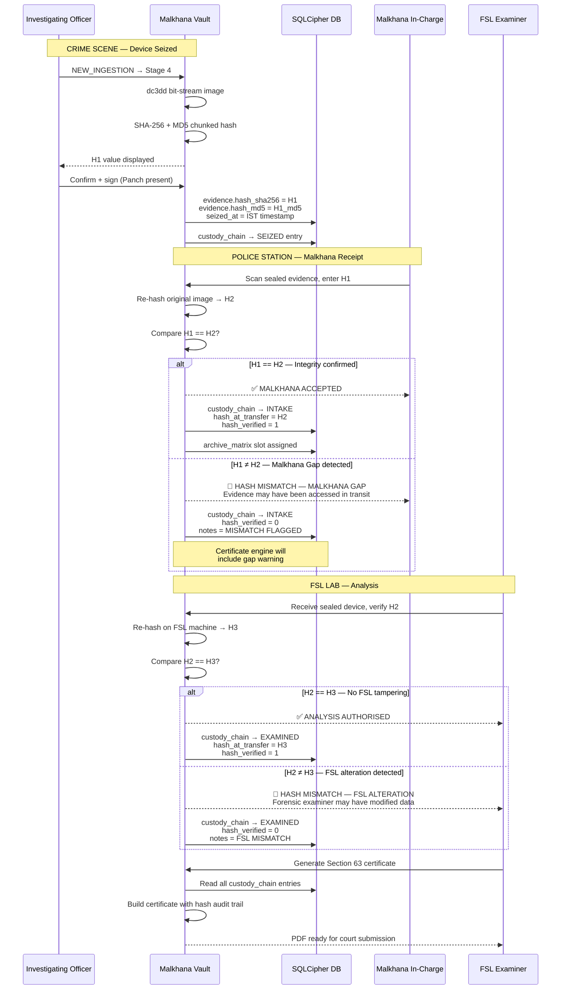

# TRIPLE-HASH VERIFICATION PROTOCOL (H₁ → H₂ → H₃)

Digital evidence is highly volatile. The primary challenge in court is proving that a seized electronic device has not been modified between the crime scene and the forensic laboratory.

To satisfy the stringent standards of **Section 63 of the Bharatiya Sakshya Adhiniyam (BSA), 2023**, Malkhana Vault implements the **Triple-Hash Verification Protocol**.

---

## 1. The Three Cryptographic Checkpoints

Malkhana Vault mandates dual-hashing (generating both **SHA-256** and **MD5** simultaneously) at three distinct milestones in the custody lifecycle:

```
+-----------------------------------------------------------------+
|                     H1: BIRTH HASH (Crime Scene)                |
|  - Generated by: Investigating Officer (IO)                     |
|  - Time: Immediately upon device seizure / field acquisition   |
|  - Legal Proof: Proves the original data state at crime scene   |
+--------------------------------+--------------------------------+
                                 |
                                 v  (Transit in Faraday Bag)
                                 |
+--------------------------------+--------------------------------+
|                    H2: RECEIPT HASH (Malkhana Entry)            |
|  - Generated by: Malkhana In-charge / FSL Intake Clerk          |
|  - Time: Before opening the physical seal / placing in drawer   |
|  - Verification: Enforces H1 == H2 (No "Malkhana Gap")          |
+--------------------------------+--------------------------------+
                                 |
                                 v  (Forensic Extraction)
                                 |
+--------------------------------+--------------------------------+
|                   H3: ANALYSIS HASH (Post-Imaging)             |
|  - Generated by: FSL Forensic Examiner                          |
|  - Time: After writing bit-stream image to analysis workstation  |
|  - Verification: Enforces H2 == H3 (Proves no examiner alteration)|
+-----------------------------------------------------------------+
```

---

## 2. Sequence Diagram

This sequence diagram illustrates how the three hashes are verified and tracked across roles:



---

## 3. Legal Implications of Mismatches

- **H1 ≠ H2 ("Malkhana Gap"):** Points to tampering or access during transport from the crime scene to the station. Under BNSS Section 153 and BSA Section 63, this mismatch is grounds for the defense to challenge the admissibility of the electronic record.
- **H2 ≠ H3 ("Examiner Alteration"):** Indicates that forensic extraction altered the source evidence (e.g. failure to use a hardware write-blocker). 
- **The Vault Safeguard:** Malkhana Vault is an **append-only database**. H1, H2, and H3 values cannot be overwritten or edited once written. All mismatches are highlighted automatically in the generated BSA Section 63 Certificate, ensuring transparent disclosure before the court.
